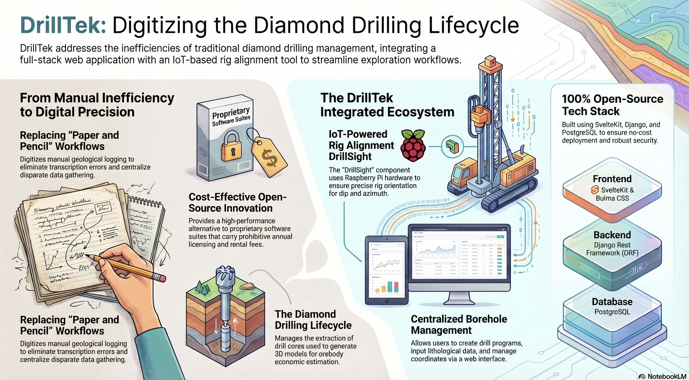

## DrillTek - Joshua Smiles

### Abstract

DrillTek is an open-source, web-based solution for managing and logging boreholes in extractive industry. It is designed to be used inside mining operations and exploration companies.

The application is three-tier, comprising a Svelte-based client, an API service built using Django Rest Framework, and a PostgreSQL database.

Users can create borehole programs comprised of individual boreholes and upload geological logging information associated with them. This information is then available for access via 3D orebody modeling software.

| | |
|-------|-------|
| **Project Number** | 14 |
| **Student Name** | Joshua Smiles |
| **Student Number** | 20108881 |
| **Supervisor** | David Drohan |
| **Project Title** | DrillTek |
| **Landing Page** | https://joshuasmiles0.github.io/DrillTek/ |
| **Project Type** | Web App |

