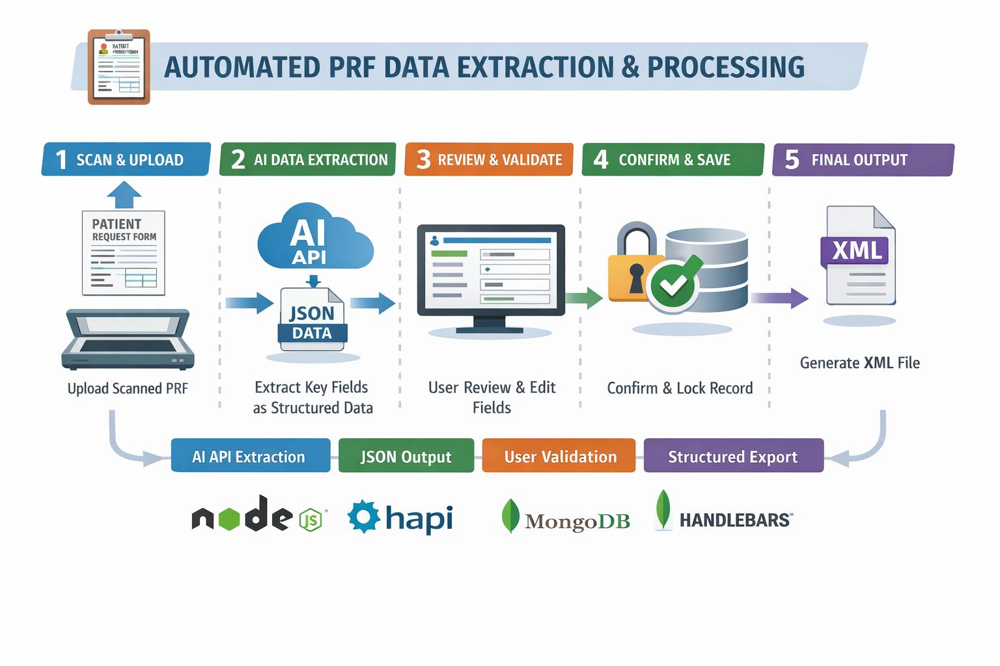

# EnferVision - Daniel Cullen

### Abstract

enferVision is a full-stack browser-based app designed to streamline data extraction and processing of patient request forms. The system uses AI to extract structured data from scanned documents and allows users to review and validate the extracted patient information through a user-friendly interface. It supports the full workflow from document ingestion to final XML generation, with features including role-based authentication, data validation, user observations, and audit logging. The platform reduces manual data entry and enhances traceability within clinical data handling processes.

| | |
|-------|-------|
| **Project Number** | 4 |
| **Student Name** | Daniel Cullen |
| **Student Number** | 20027857 |
| **Supervisor** | Lacey, Richard |
| **Project Title** | EnferVision |
| **Landing Page** | https://enfervisionprojectshowcase.onrender.com |
| **Project Type** | Web App - Local Hosted |

