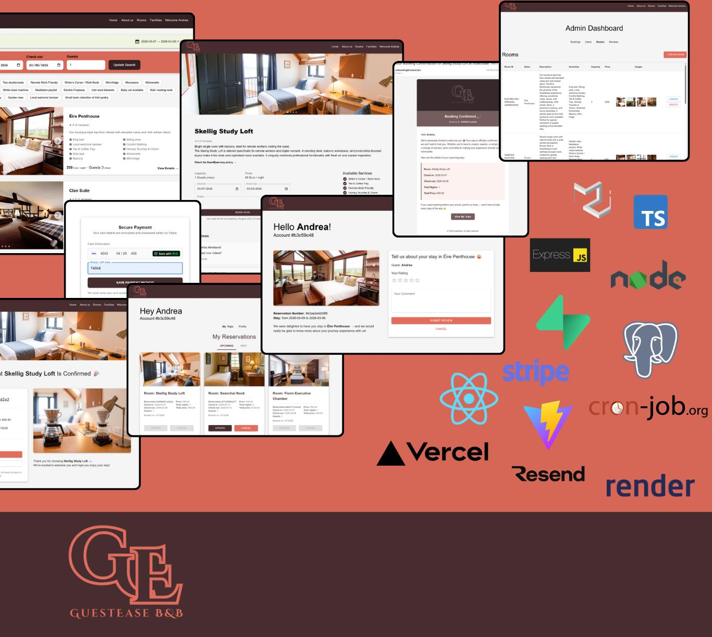

## GuestEase - Andrea Nardinocchi

### Abstract

GuestEase is a full-stack web app designed for small hospitality businesses such as B&B, guesthouses, and small boutique hotels. This booking system enables users to create and manage their bookings, profiles, write reviews, while also processing Stripe payments. It features an admin dashboard through which the administrator can create, and manage bookings, user accounts, manage rooms availability, and read users' reviews. It triggers email notifications, which can be cron-automated. Its goal is to provide a user-friendly tool to streamline the user experience on both ends: guests and admin.

| | |
|-------|-------|
| **Project Number** | 2 |
| **Student Name** | Andrea Nardinocchi |
| **Student Number** | 20108884 |
| **Supervisor** | Fitzpatrick, Catherine |
| **Project Title** | GuestEase |
| **Landing Page** | https://guestease-landing.vercel.app/ |
| **Project Type** | Web App |

