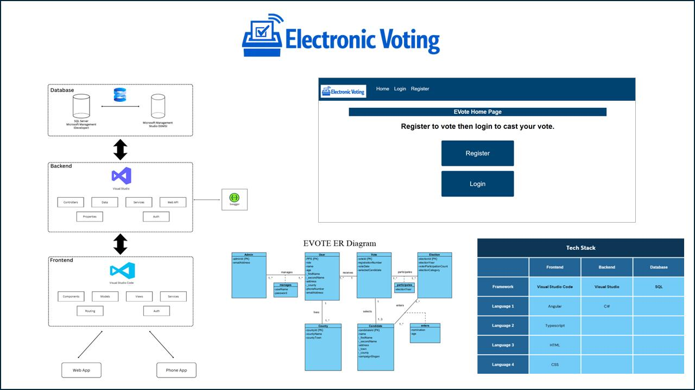

# EVOTE - Jake Nagle

### Abstract

This project is a full-stack web application simulating a secure and accessible electronic voting system. Users can register, log in, and cast a vote. The frontend is built on Visual Studio Code with Angular, the backend with Visual Studio using C#, and SQL Server Management 22 is used for database. An admin panel allows management of users, candidates, elections, and viewing vote analytics. Security is implemented using JWT tokens and hashing of user passwords. The system implements accessibility features to support users with reading and sight disabilities.

| | |
|-------|-------|
| **Project Number** | 12 |
| **Student Name** | Jake Nagle |
| **Student Number** | 20109020 |
| **Supervisor** | Fitzpatrick, Catherine |
| **Project Title** | EVOTE |
| **Landing Page** | https://jake-nagle123.github.io/EVoting/project.html |
| **Project Type** | Web App |

