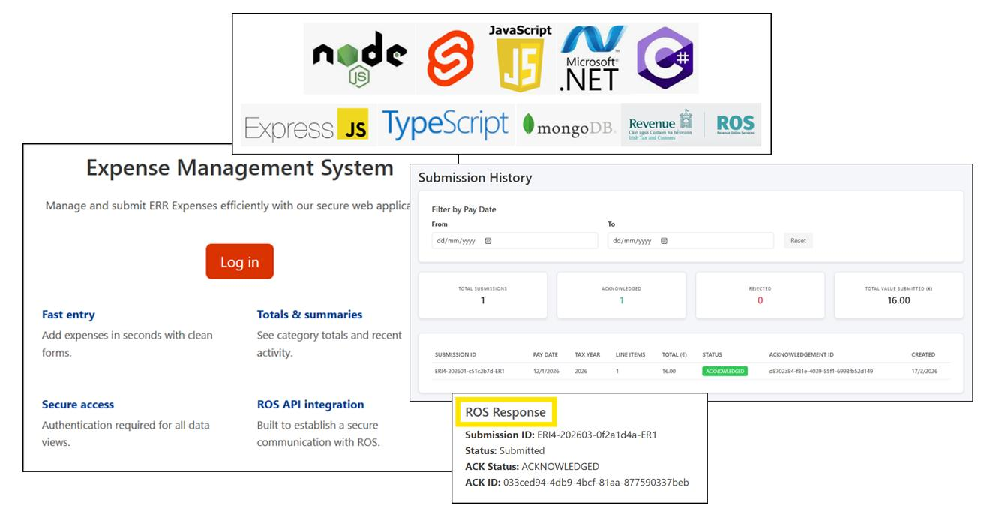

## ERR!!! - Elaine Rice

### Abstract

ERR!: Full Stack Expenses Web App is an expense management system designed to model Ireland’s Enhanced Reporting Requirements (ERR) workflow. Built with SvelteKit, Node.js, MongoDB, and a dedicated .NET signing microservice, the application generates compliant ERR JSON submissions and securely communicates with Revenue’s ROS PIT3 REST API using RSA-SHA512 digital signatures. The system includes RBAC, and a persistent submission audit trail. It demonstrates secure API integration, cryptographic request signing, and enterprise-style reporting architecture in a real-world compliance context.

| | |
|-------|-------|
| **Project Number** | 6 |
| **Student Name** | Elaine Rice |
| **Student Number** | 20108879 |
| **Supervisor** | Hogan, Sonya |
| **Project Title** | ERR!!! |
| **Landing Page** | https://bit.ly/ERR_Expense_Mgt_System |
| **Project Type** | Web App |

