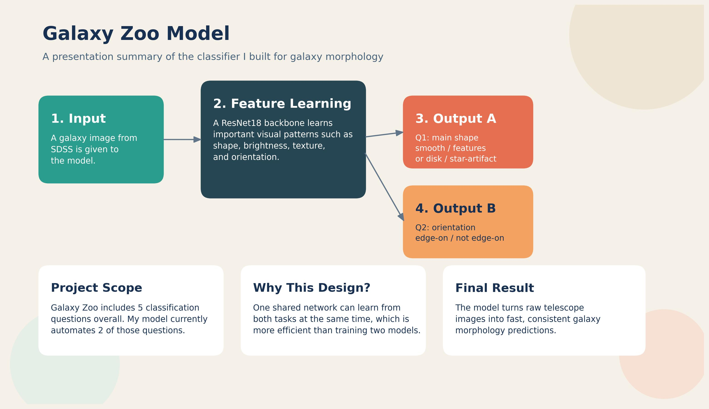

## Galaxy Classifier - Giovanni Serra

### Abstract

This project uses PyTorch to classify galaxy images from the Galaxy Zoo dataset.

It focuses on two of the five Galaxy Zoo questions: identifying the main galaxy shape and detecting whether the galaxy is edge-on.

The workflow includes preparing labels, downloading images, training a model with a ResNet18 backbone, and making predictions.

The project shows how deep learning can support astronomy by producing fast and consistent galaxy classifications from telescope images, helping demonstrate how computer vision can be applied to real scientific data.

| | |
|-------|-------|
| **Project Number** | 10 |
| **Student Name** | Giovanni Serra |
| **Student Number** | 20108880 |
| **Supervisor** | Tamassum, Mujahid |
| **Project Title** | Galaxy Classifier |
| **Landing Page** | https://galaxyclassifier.netlify.app/ |
| **Project Type** | AI |

