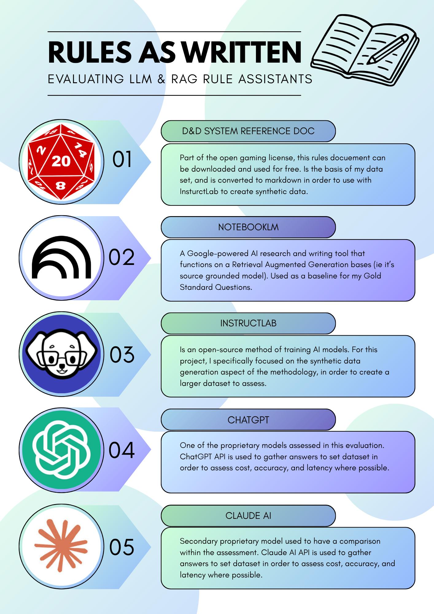

# RAW - Leanne Ahern

### Abstract

The goal of this project was to investigate the use of Large Language Models and Retrieval-Augmented Generation frameworks as a rule-assistance tool for Tabletop Role-Playing Games (TTRPGs) with a specific focus on Dungeons and Dragons 5th Edition. The initial aim was to assess the accuracy, cost, and latency of different models when providing information from a dedicated ruleset. However, it evolved to include a general configuration that others could use to trial and test the accuracy of AI models using my work as a guide.

| | |
|-------|-------|
| **Project Number** | 16 |
| **Student Name** | Leanne Ahern |
| **Student Number** | 20108905 |
| **Supervisor** | Windle, Peter |
| **Project Title** | RAW |
| **Landing Page** | http://bit.ly/4lZ4LZt |
| **Project Type** | AI |

