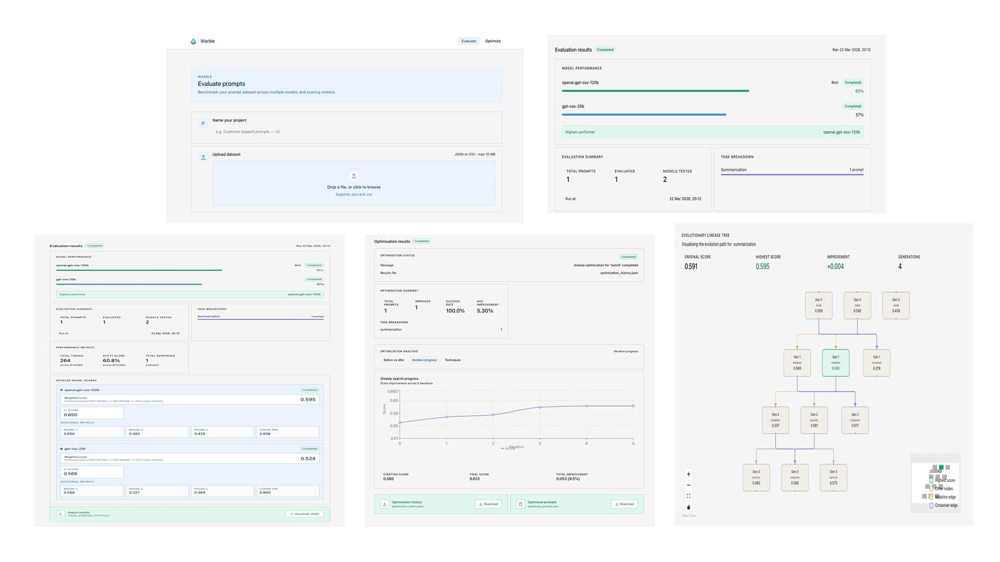

# Warble - Rhiannah Maher

### Abstract

*Warble* automates prompt evaluation and optimisation across multiple Large Language Models (LLMs). Built with a React front end and Python FastAPI back end, users can submit prompts and evaluate responses using F1-Score, ROUGE, and cosine similarity. 
Prompts are optimised through greedy and evolutionary search algorithms. The system integrates AWS Bedrock for LLM inference and is deployed on AWS for scalability. *Warble* provides visual feedback on prompt performance, offering a structured alternative to manual prompt engineering across different LLM architectures.

| | |
|-------|-------|
| **Project Number** | 26 |
| **Student Name** | Rhiannah Maher |
| **Student Number** | 20085527 |
| **Supervisor** | Fitzgerald, Mary |
| **Project Title** | Warble |
| **Landing Page** | https://bit.ly/Warble |
| **Project Type** | AI |

