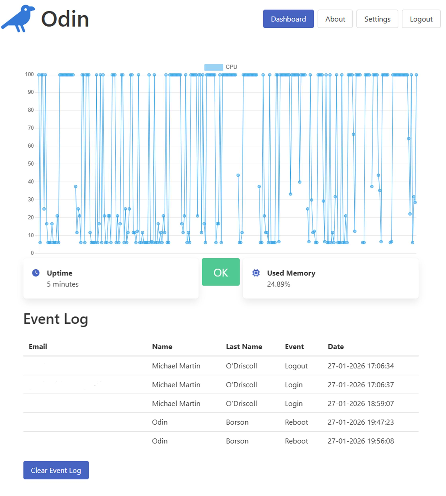
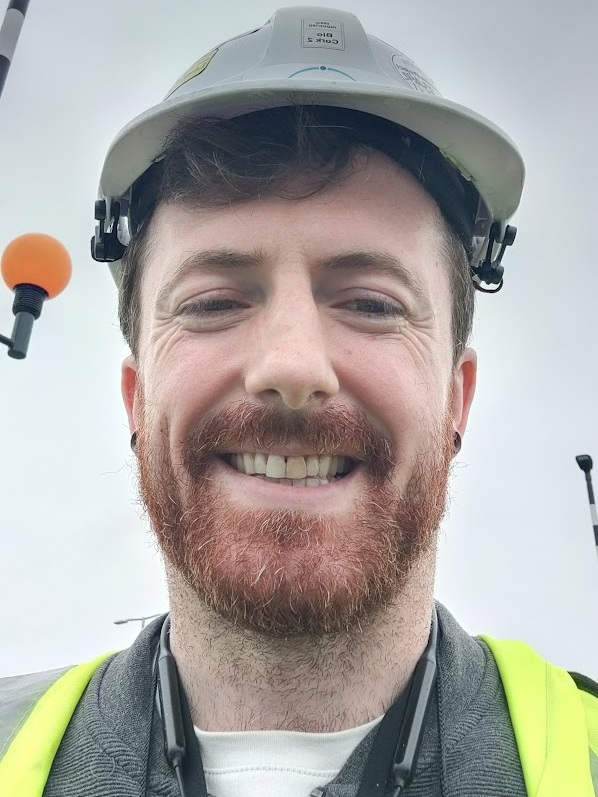

## Odin - Michael O'Driscoll

### Abstract

An autonomous cloud infrastructure system monitors EC2 instances on Amazon Web Services, analyzing and responding to operational events to ensure reliability, scalability, and resilience across multiple cloud instances. It continuously tracks key metrics such as CPU usage, memory consumption, network bandwidth, uptime, and database storage. An AI agent from OpenAI analyzes recent datasets to summarize overall system health, identify potential risks, and recommend corrective actions. All metrics, event logs, and AI insights are presented on a dashboard for monitoring and decision-making.

| | |
|-------|-------|
| **Project Number** | 20 |
| **Student Name** | Michael O'Driscoll |
| **Student Number** | 20099693 |
| **Supervisor** | Drohan, David |
| **Project Title** | Odin |
| **Landing Page** | https://github.com/modrisco89/Odin |
| **Project Type** | Cloud / Dev Ops/ |

