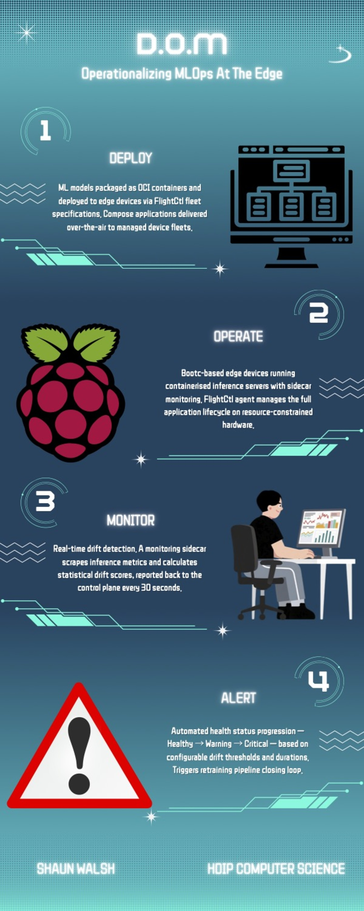

## DOM - Shaun Walsh

### Abstract

FlightCtl manages edge device fleets in a Kubernetes like way. While MLOps is straightforward in cloud platforms, it grows harder at the edge due to constrained resources and connectivity. FlightCtl monitors device health but lacks ML model observability. This project closes that gap using a sidecar pattern, keeping FlightCtl framework-agnostic. The agent is extended with an ML Model Monitor that translates drift scores into Healthy/Warning/Critical status, triggering retraining when thresholds are exceeded. A reference MLOps app demonstrates end-to-end model deployment to edge devices.

| | |
|-------|-------|
| **Project Number** | 28 |
| **Student Name** | Shaun Walsh |
| **Student Number** | 20005831 |
| **Supervisor** | Windle, Peter |
| **Project Title** | DOM |
| **Landing Page** | https://bit.ly/AI-DOM |
| **Project Type** | Cloud Edge / AI |

