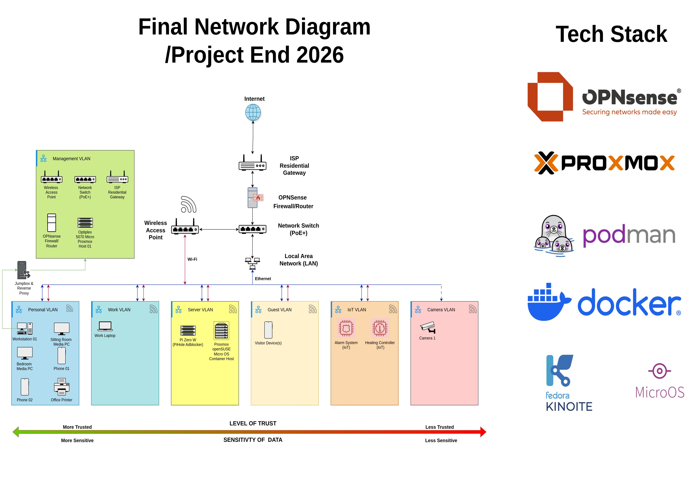
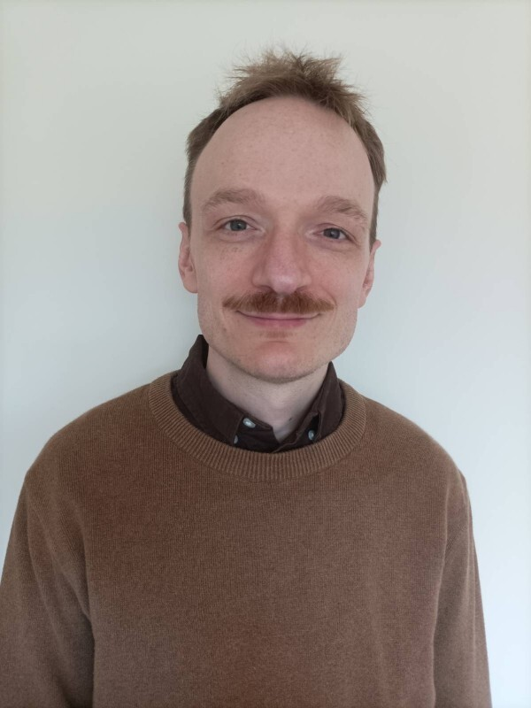

## There's No Place Like Home - Wolfgang Helnwein

### Abstract

'There’s No Place Like Home' shows how a typical home network can become a secure, scalable, privacy-focused homelab using open-source tools. It employs VLAN-based segmentation, a custom OPNsense router, a managed switch, and Proxmox for self-hosting to enable network isolation and flexible service deployment. Focused on hands-on learning, the project develops systems administration and architecture skills through iterative, experiential practice. Favouring locally hosted services and recycled hardware, it also demonstrates how individuals can cut cloud dependence and reduce electronic waste.

| | |
|-------|-------|
| **Project Number** | 31 |
| **Student Name** | Wolfgang Helnwein |
| **Student Number** | 20108891 |
| **Supervisor** | Fitzgerald, Mary |
| **Project Title** | There's No Place Like Home |
| **Landing Page** | https://urlr.me/!homelab |
| **Project Type** | Cloud Networking |

