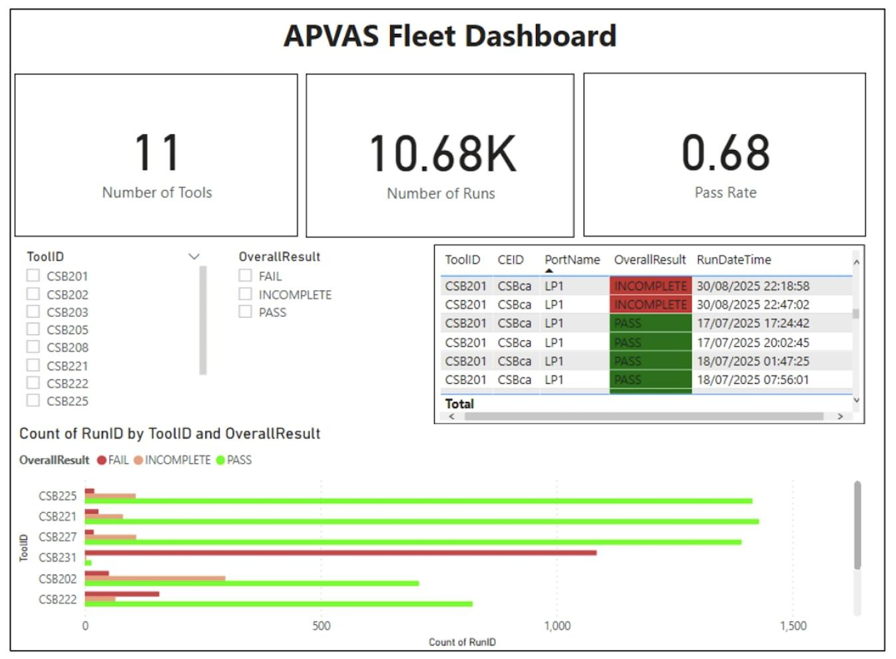

## APAVS - Vincent Byrne

### Abstract

APAVS automates the monitoring of load port qualification data across a fleet of semiconductor manufacturing tools. Currently, technicians manually export log files, run Excel macros, and visually inspect qualification plots for individual tools with no fleet-wide visibility. APAVS replaces this workflow with a PowerShell extraction pipeline that retrieves data directly from tool hard drives, parses raw sensor logs, and calculates slot-level offsets against taught reference positions. Results are stored in a SQL Server database and visualised through a Power BI.

| | |
|-------|-------|
| **Project Number** | 30 |
| **Student Name** | Vincent Byrne |
| **Student Number** | 20108898 |
| **Supervisor** | Hogan, Sonya |
| **Project Title** | APAVS |
| **Landing Page** | https://bit.ly/4rJabZx |
| **Project Type** | Cloud Networking PowerBI |

