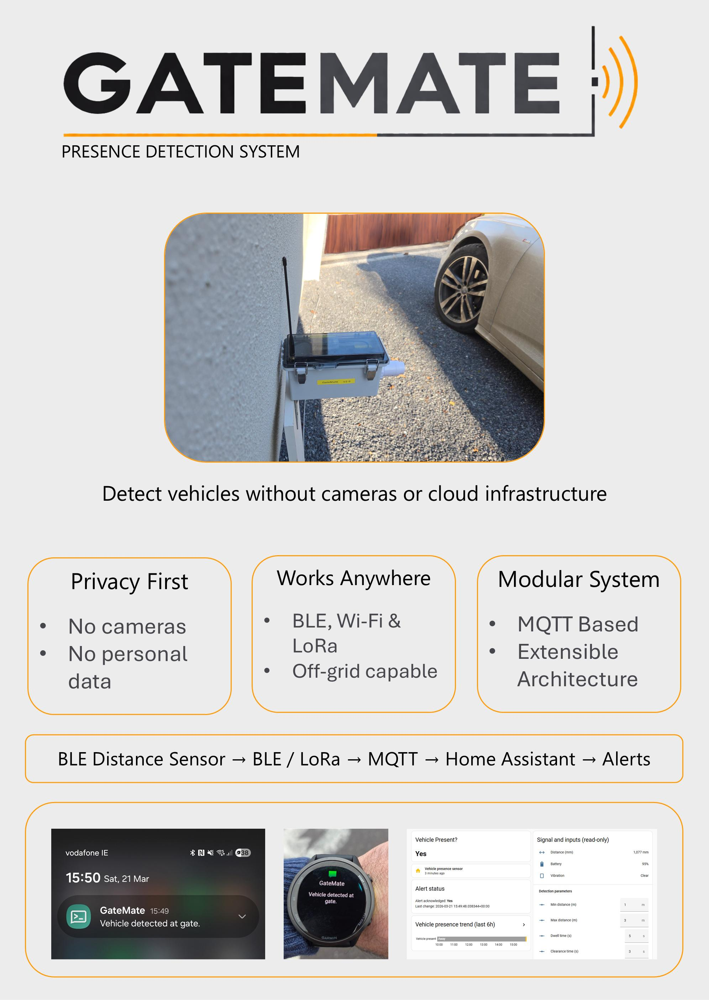

## GateMate - Aidan Clancy

### Abstract

GateMate is a privacy-first vehicle presence detection system for gates and access points. It uses distance-based sensing and time-threshold logic to generate a stable presence state without relying on cameras or cloud processing. A modular architecture separates sensing, transport, and processing via MQTT. Support for BLE and LoRa (Long Range Radio) enables deployment across domestic, rural, and temporary environments, providing a low-power,, long-range, extensible solution for real-world applications.

| | |
|-------|-------|
| **Project Number** | 1 |
| **Student Name** | Aidan Clancy |
| **Student Number** | 20062567 |
| **Supervisor** | Fitzgerald, Mary |
| **Project Title** | GateMate |
| **Landing Page** | https://bit.ly/GateMateLab |
| **Project Type** | IoT |

