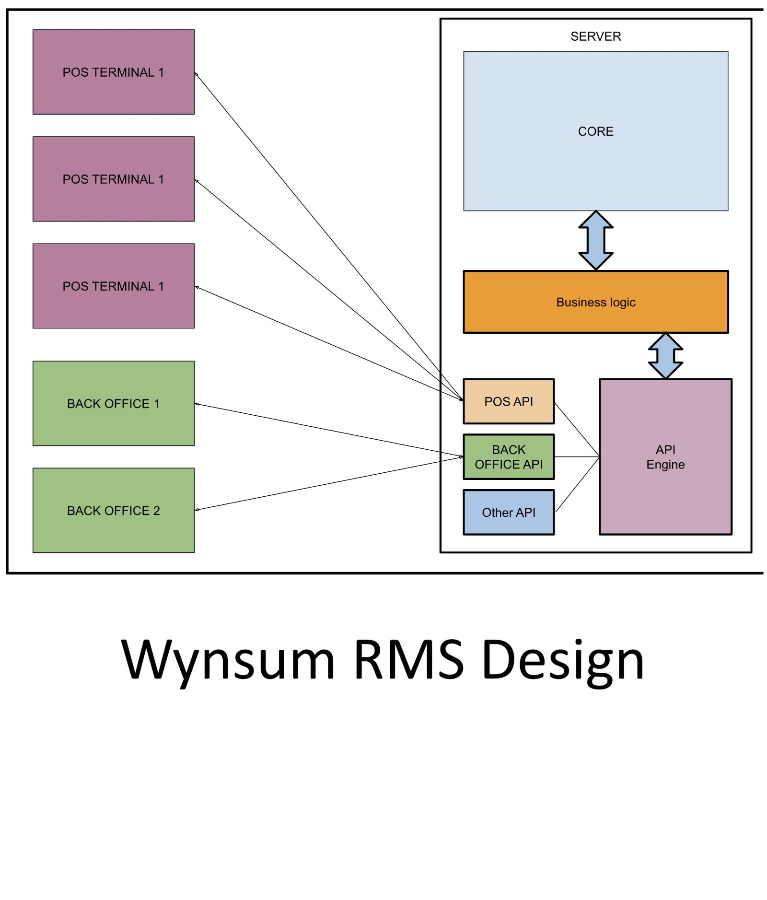

# WynSum RMS - Vadym Melnychenko

### Abstract

This project delivered Wynsum POS, a high-performance PWA within an Edge-Native RMS. It bridges the gap between complex marketing needs and legacy infrastructure. Redefining performance for retail, the system eschews traditional caching to ensure 100% data consistency. Using a WebSocket-based JSON-RPC protocol and row virtualization, it manages 10,000+ items at 60 FPS. Adhering to "Zero Trust," all financial logic is server-side and secured via ECDSA hardware keys. An Asynchronous Checkout Pipeline ensures sub-5ms response times during complex multi-step retail transactions.

| | |
|-------|-------|
| **Project Number** | 29 |
| **Student Name** | Vadym Melnychenko |
| **Student Number** | 20108893 |
| **Supervisor** | Mc Mahon, Michael |
| **Project Title** | WynSum RMS |
| **Landing Page** | https://project.wynsum.ie/ |
| **Project Type** | Full Stack App |

