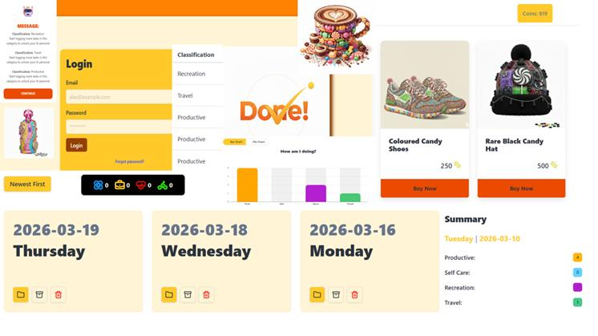

## "DONE!" - Noemi Lovei

### Abstract

A gamified tracker of all things done available on a webapp, supplemented with in-game currency and in-app statistics and charts for visualising user engagement. Built with a nodejs backend exposing the backend APIs, storing data through a MYSQL database and a react frontend all the while connected to a custom python mini AI server making recommendations based on user activity and delivering through web API. Built with robust front-end design, keeping data security and good database practices in mind.

| | |
|-------|-------|
| **Project Number** | 22 |
| **Student Name** | Noemi Lovei |
| **Student Number** | 20108892 |
| **Supervisor** | Lacey, Richard |
| **Project Title** | "DONE!" |
| **Landing Page** | https://nilanoemi25.github.io/project-/ |
| **Project Type** | Full Stack App |

