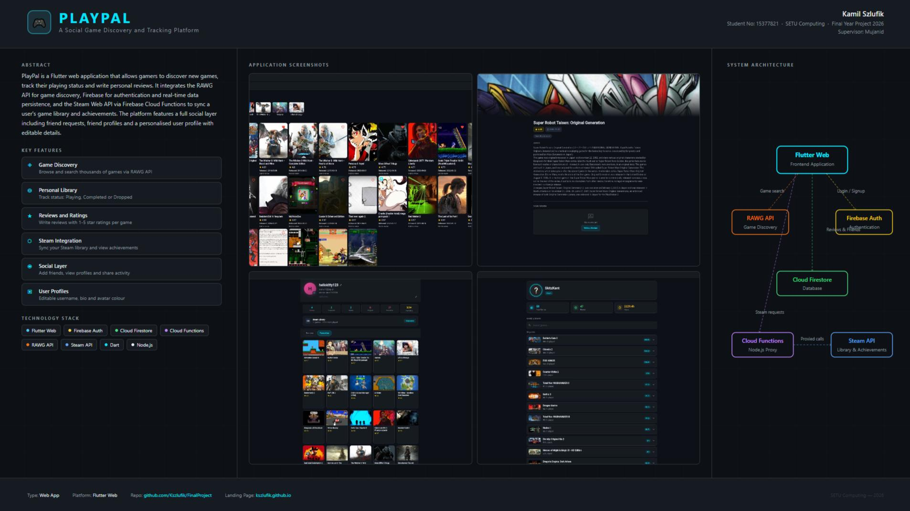

# PlayPal - Kamil Szlufik

### Abstract

PlayPal is a Flutter web application that allows gamers to discover new games, track their playing status and write personal reviews. It integrates the RAWG API for game discovery, Firebase for authentication and real-time data persistence, and the Steam Web API via Firebase Cloud Functions to sync a user's game library and achievements. The platform features a full social layer including friend requests, friend profiles and a personalised user profile with editable details, avatar customisation and an activity feed.

| | |
|-------|-------|
| **Project Number** | 15 |
| **Student Name** | Kamil Szlufik |
| **Student Number** | 15377821 |
| **Supervisor** | Tamassum, Mujahid |
| **Project Title** | PlayPal |
| **Landing Page** | https://kszlufik.github.io/FinalProject/ |
| **Project Type** | Hybrid. App |

