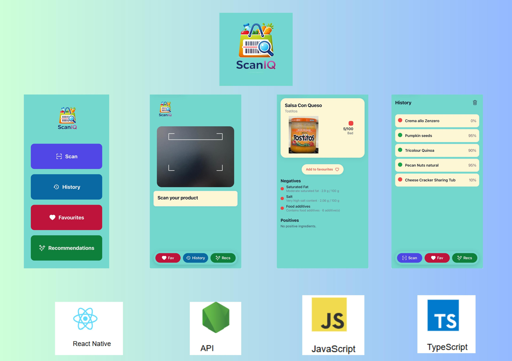

## ScanIQ - Ludmila Bulat

### Abstract

ScanIQ is a mobile application that helps users better understand food products by scanning barcodes and analysing ingredient data. The app integrates the OpenFoodFacts API to retrieve product information and applies a custom scoring system based on nutritional values such as sugar, salt, additives, and fibre. Users receive a simple colour-coded score and clear explanations, along with healthier product recommendations. The application also includes features such as scan history and favourites, focusing on usability, transparency, and informed decision-making.

| | |
|-------|-------|
| **Project Number** | 17 |
| **Student Name** | Ludmila Bulat |
| **Student Number** | 20108895 |
| **Supervisor** | Drohan, David |
| **Project Title** | ScanIQ |
| **Landing Page** | https://expo.dev/accounts/ludmila20108895/projects/scaniq |
| **Project Type** | Hybrid. App |

