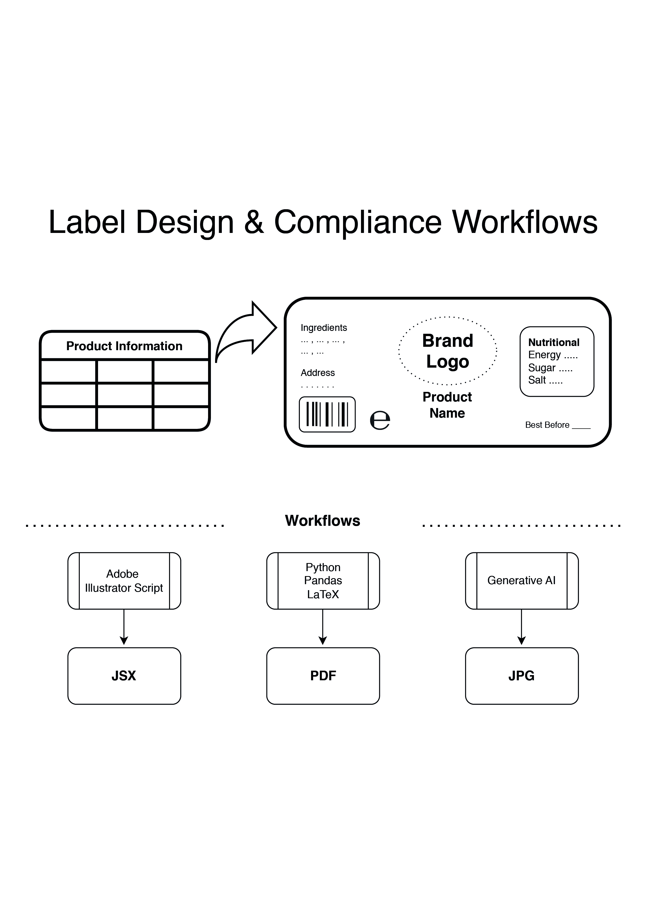

## Label Design & Compliance Workflows - Pedro Royo

### Abstract

This project explores different ways to automate label design, particularly the initial steps of the design process. These steps include checking for compliance with European regulations and gathering each item of information that needs to appear on the label. Both tasks can be very time consuming and prone to error when done manually. 

The approaches researched include Adobe Illustrator scripting, Generative AI, and Python with Pandas library for data manipulation along typesetting with LaTeX. Suitable approaches may be effectively adopted into the design workflow.

| | |
|-------|-------|
| **Project Number** | 24 |
| **Student Name** | Pedro Royo |
| **Student Number** | 11704831 |
| **Supervisor** | Tamassum, Mujahid |
| **Project Title** | Label Design & Compliance Workflows |
| **Landing Page** | https://bit.ly/LabelAutomator |
| **Project Type** | Automation |

