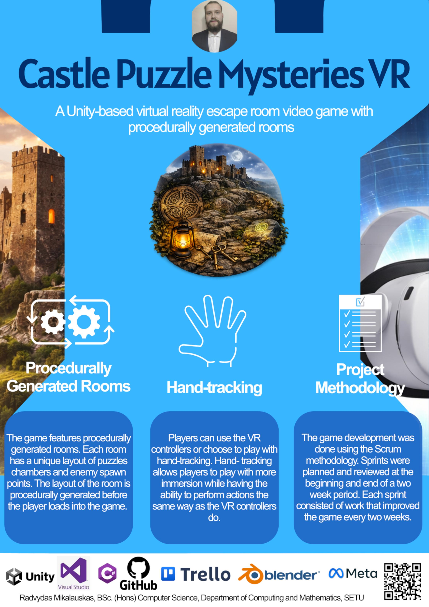

## Castle Puzzle Mysteries VR - Radvydas Mikalauskas

### Abstract

Castle Puzzle Mysteries VR is a game developed using Unity and C#. The player's goal is to navigate through the procedurally generated rooms and solve puzzles that are stopping them from progressing down the castle. The player encounters enemies that spawn and try to prevent the player from leaving. The enemies can be dealt with by using weapons found throughout the level. The game is played in VR using the provided controllers. The player can choose to switch to hand-tracking mode for a more immersive feel and use hand gestures to teleport, grab and interact with objects in the level.

| | |
|-------|-------|
| **Project Number** | 24 |
| **Student Name** | Radvydas Mikalauskas |
| **Student ID** | W20098619 |
| **Supervisor** | Brendan Lyng |
| **Project Title** | Castle Puzzle Mysteries VR |
| **Landing Page** | https://radvydasm.github.io/ |
| **Programme** | BSc (Honours) in Applied Computing |

