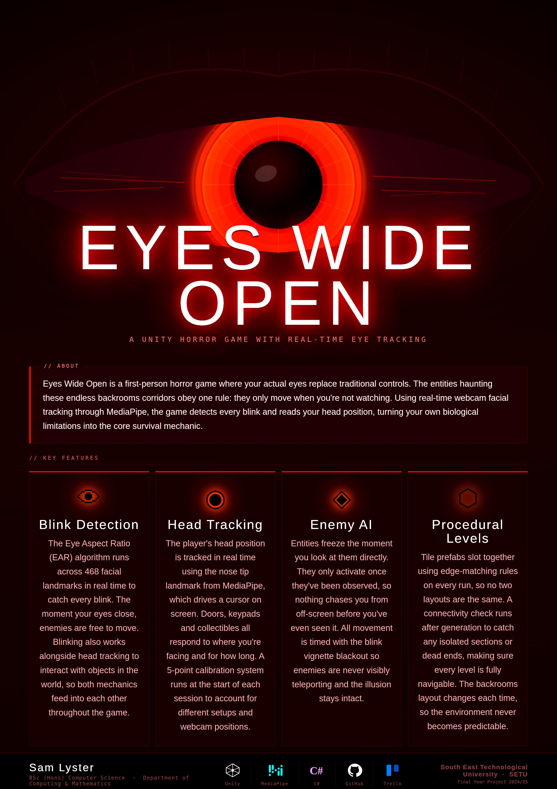

## Eyes Wide Open - Samuel Lyster Cummins

### Abstract

Eyes Wide Open is a first-person horror game where your actual eyes replace traditional controls. Using a standard webcam and the MediaPipe framework, the game tracks head position in real time to drive an on-screen cursor for interaction, while blink detection controls enemy behaviour. Players explore procedurally generated backrooms environments, collecting hidden codes and inputting them at keypads to progress through each level. Enemies can only move when the player is not observing them, making blink detection and head tracking central to survival.

| | |
|-------|-------|
| **Project Number** | 20 |
| **Student Name** | Samuel Lyster Cummins |
| **Student ID** | W20102256 |
| **Supervisor** | Kurt Pumares |
| **Project Title** | Eyes Wide Open |
| **Landing Page** | https://samuellystercummins0.github.io/EyesWideOpen-FYP/ |
| **Programme** | BSc (Honours) in Applied Computing |

