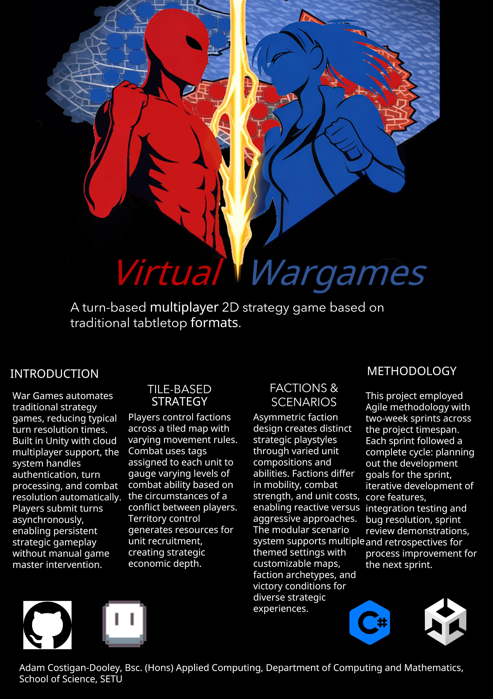

## Lineage Virtual Wargaming - Adam Costigan Dooley

### Abstract

Virtual Wargaming adapts a turn-based strategy gameplay found in Discord wargaming communities, intended to be in aid of reducing multi-day turn resolution to minutes for users designing and adapting their own Lineage format, or playing a provided preset. Built in Unity with C#, the system features a territory hex map, asymmetric faction design with unique units, and sophisticated combat mechanics including casualty resolution and unique ability interactions. Players coordinate attacks through an intuitive UI, while Photon Fusion networking enables real-time multiplayer with 2-6 players.

| | |
|-------|-------|
| **Project Number** | 8 |
| **Student Name** | Adam Costigan Dooley |
| **Student ID** | W20101954 |
| **Supervisor** | Michael McMahon |
| **Project Title** | Lineage Virtual Wargaming |
| **Landing Page** | https://adam-costigan-dooley.github.io/VirtualWargame/ |
| **Programme** | BSc (Honours) in Applied Computing |

