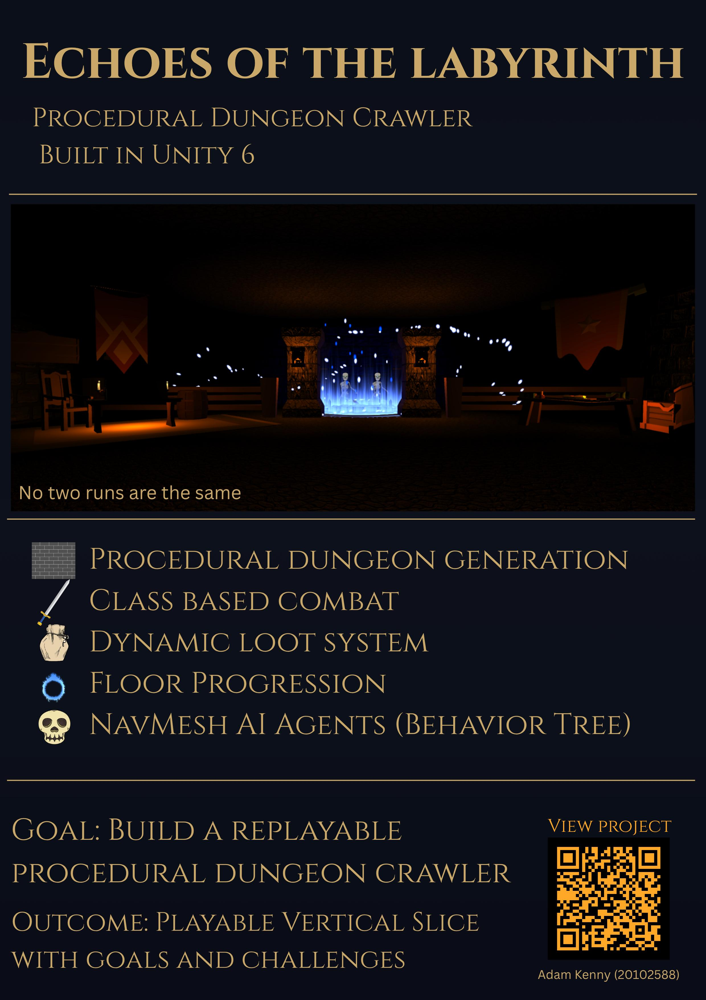

# Echoes of the Labyrinth - Adam Kenny

### Abstract

Echoes of the Labyrinth is a 3D , Unity-based procedural dungeon crawler. 
Players explore dynamically generated floors, battle enemies using AI-driven behaviours, and collect loot while progressing deeper into an evolving labyrinth. 
The project emphasises modular systems, and replayability through procedural generation, combat mechanics, and adaptive AI encounters.
Every action has consequences that could lead to victory in battle or the player's character becoming just another Echo in the Labyrinth

| | |
|-------|-------|
| **Project Number** | 18 |
| **Student Name** | Adam Kenny |
| **Student ID** | W20102588 |
| **Supervisor** | Dr Denis Flynn |
| **Project Title** | Echoes of the Labyrinth |
| **Landing Page** | https://github.com/AdamKenny098/Final-Year-Project |
| **Programme** | BSc (Honours) in Applied Computing |

