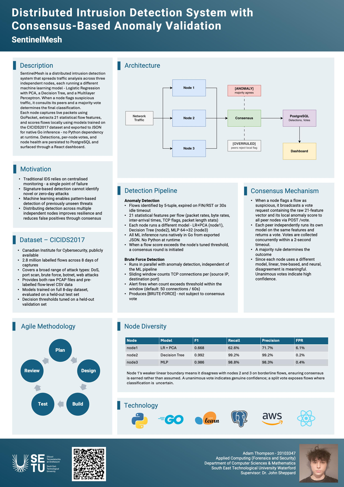

# SentinelMesh - Adam Thompson

### Abstract

SentinelMesh is a distributed intrusion detection system that spreads traffic analysis across three independent nodes, each running a different machine learning model - Logistic Regression with PCA, Decision Tree, and MLP. When a node flags suspicious traffic, it consults its peers and a majority vote determines the final classification, reducing false positives without sacrificing recall. Each model draws different decision boundaries, so disagreement on borderline flows is meaningful. All ML inference runs natively in Go from exported JSON meaning there is no Python at runtime.

| | |
|-------|-------|
| **Project Number** | 31 |
| **Student Name** | Adam Thompson |
| **Student ID** | W20103347 |
| **Supervisor** | Dr John Sheppard |
| **Project Title** | SentinelMesh |
| **Landing Page** | https://adamthompson43.github.io/distributed-ids/ |
| **Programme** | BSc (Honours) in Applied Computing |

