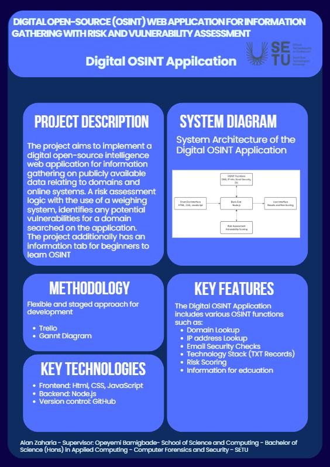

#  - Alan Zaharia

### Abstract

The project aims to implement a digital open-source intelligence web application for information gathering on publicly available data relating to domains and online systems. The project incorporates multiple digital OSINT functions such as DNS record lookups, IP address lookups, WHOIS data, mail policies, mail exchange, etc into a single application using APIs.
A risk assessment logic with the use of a weighing system, identifies any potential vulnerabilities for a domain searched on the application.

| | |
|-------|-------|
| **Project Number** | 33 |
| **Student Name** | Alan Zaharia |
| **Student ID** | W20102420 |
| **Supervisor** | Opeyemi Bamigbade |
| **Project Title** |  |
| **Landing Page** | https://alainel27.github.io/FYP-LandingSite/ |
| **Programme** | BSc (Honours) in Applied Computing |

