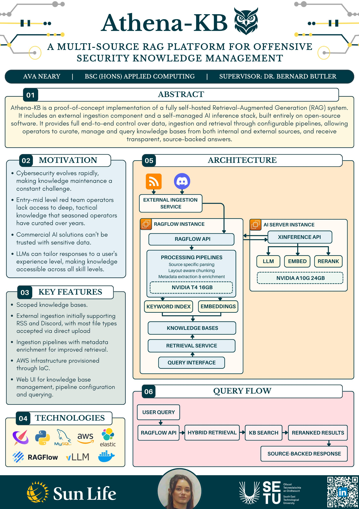

# Athena-{KB} - Ava Neary

### Abstract

Athena-KB is a proof-of-concept implementation of a fully self-hosted Retrieval-Augmented Generation (RAG) system. It includes an external ingestion component and a self-managed AI inference stack, built entirely on open-source software. It provides full end-to-end control over data, ingestion and retrieval through configurable pipelines, allowing operators to curate, manage and query knowledge bases from both internal and external sources, and receive transparent, source-backed answers.

| | |
|-------|-------|
| **Project Number** | 25 |
| **Student Name** | Ava Neary |
| **Student ID** | W20103495 |
| **Supervisor** | Dr Bernard Butler |
| **Project Title** | Athena-{KB} |
| **Landing Page** | https://ayyvahh.github.io/FYP-Website/ |
| **Programme** | BSc (Honours) in Applied Computing |

