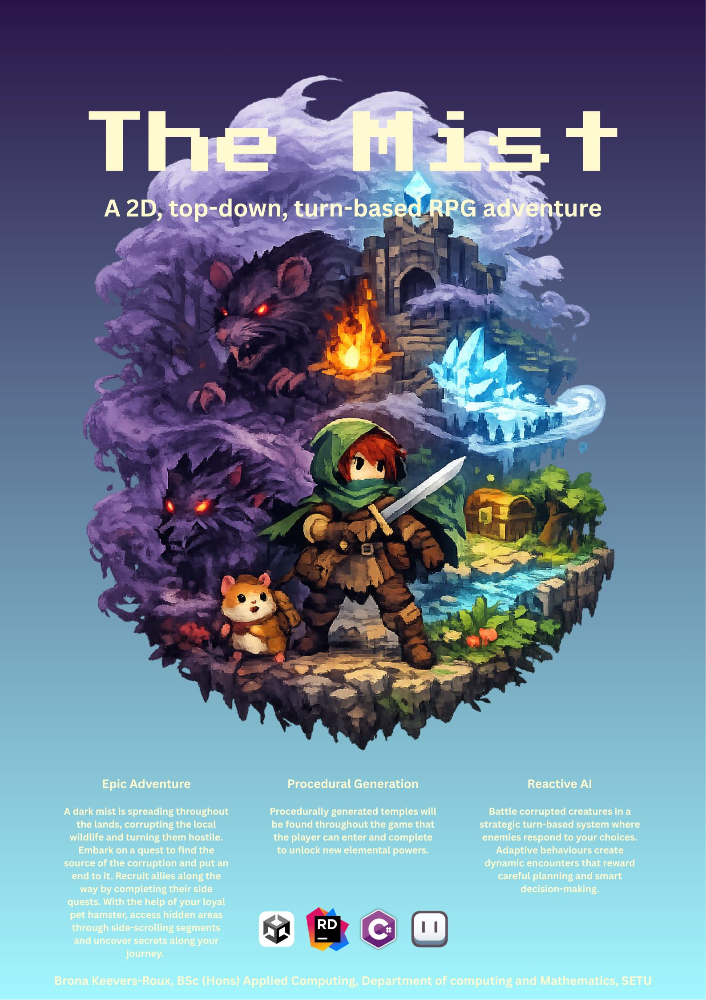

# The Mist - Brona Keevers-Roux

### Abstract

The Mist is a 2D top-down RPG adventure made in Unity for Windows PC. Players follow Eryn and their hamster companion Milo through a forest consumed by a spreading dark mist. The game features a dual gameplay system with top-down exploration and turn-based combat, plus side-scrolling sections where Milo accesses tight spaces. It uses procedural generation to create varied elemental temples and a reactive AI system where enemies adapt their behaviour in combat, creating dynamic and replayable encounters.

| | |
|-------|-------|
| **Project Number** | 16 |
| **Student Name** | Brona Keevers-Roux |
| **Student ID** | W20098883 |
| **Supervisor** | Brendan Lyng |
| **Project Title** | The Mist |
| **Landing Page** | https://hillyleopard133.github.io/Landing-Page/ |
| **Programme** | BSc (Honours) in Applied Computing |

