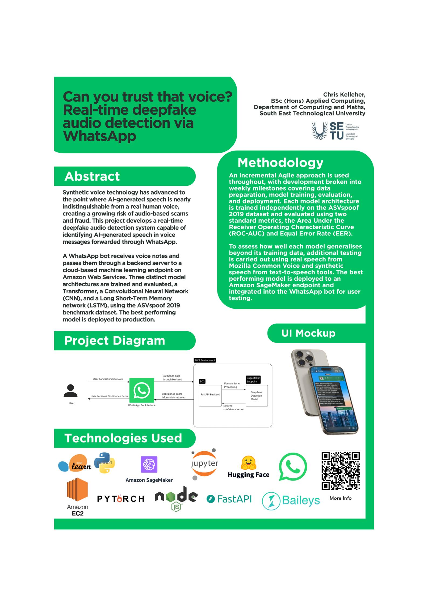

# Can You Trust That Voice? - Christopher Kelleher

### Abstract

Deepfake voice technology is increasingly common in scams and fraud, with AI-generated 
speech convincing enough to impersonate real people. This project tackles that problem by 
building a system that detects synthetic speech in real time, accessible to everyday users 
through WhatsApp. Users simply forward a suspicious voice note to the bot, which analyses the 
audio and replies with a verdict and confidence score. The system uses deep learning 
models trained to distinguish genuine human speech from AI-generated audio, and is deployed 
to the cloud for fast, scalable detections.

| | |
|-------|-------|
| **Project Number** | 17 |
| **Student Name** | Christopher Kelleher |
| **Student ID** | W20101947 |
| **Supervisor** | Rob O'Connor |
| **Project Title** | Can You Trust That Voice? |
| **Landing Page** | https://chriskelleher1947.github.io |
| **Programme** | BSc (Honours) in Applied Computing |

