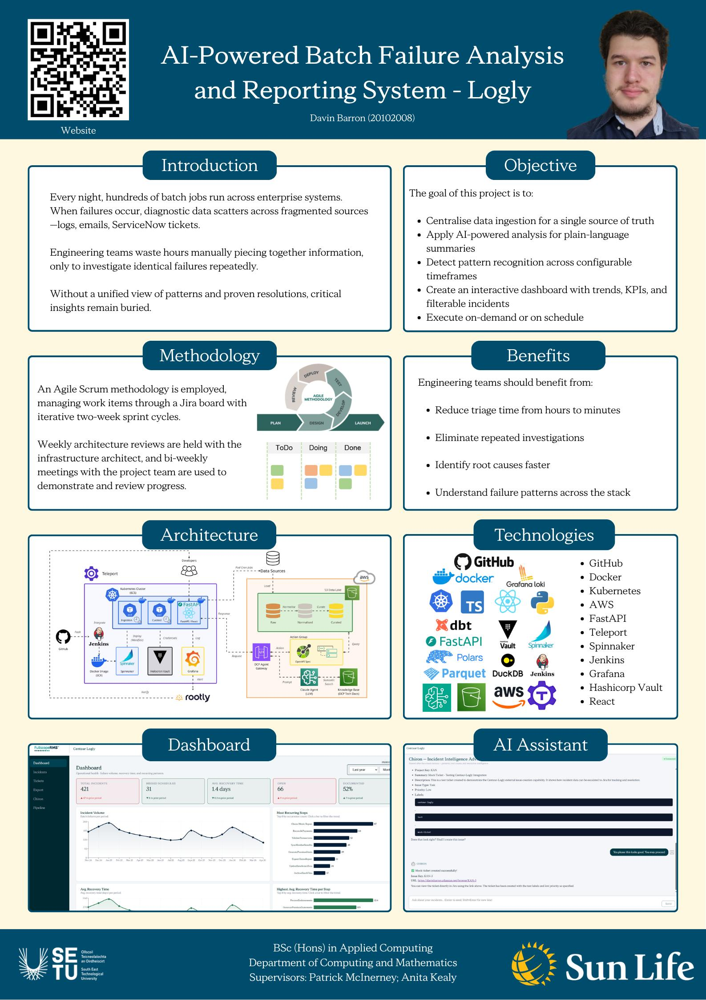

## Logly - Davin Barron

### Abstract

Logly is an AI-powered log analysis system to help engineering teams respond to batch processing failures faster. In large enterprises, diagnostic data scatters across logs, emails, and ticketing systems, forcing teams to repeatedly investigate the same failures. Logly addresses this by centralising data into a single source of truth, using a RAG pipeline to generate plain-language failure summaries and detect recurring patterns. My goal is to reduce triage time from hours to minutes through an interactive dashboard surfacing trends, KPIs, and filterable incidents.

| | |
|-------|-------|
| **Project Number** | 1 |
| **Student Name** | Davin Barron |
| **Student ID** | W20102008 |
| **Supervisor** | Patrick McInerney, Dr Anita Kealy |
| **Project Title** | Logly |
| **Landing Page** | https://davinbarron.github.io/FYP-Landing-Page/ |
| **Programme** | BSc (Honours) in Applied Computing |

