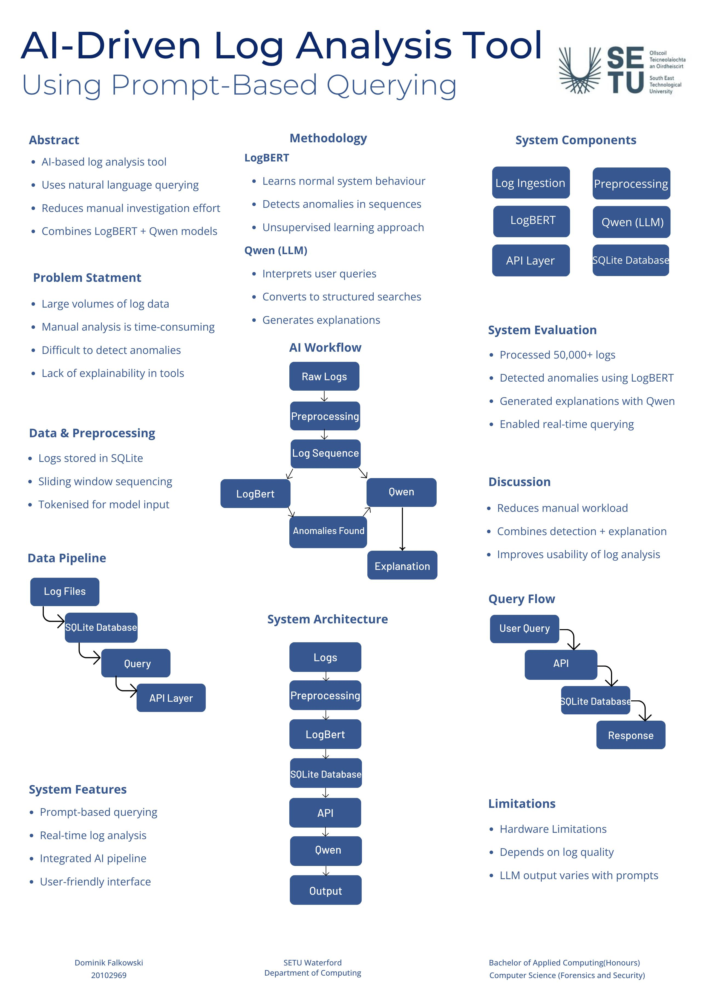

# AI-Driven Log Analysis Tool - Dominik Falkowski

### Abstract

This project develops an AI-driven log analysis tool that ingests system logs in real time, detects suspicious activity, and generates natural language explanations. Logs are continuously collected from a host machine and processed. An AI model is used to identify anomalies in log patterns, while a fine-tuned large language model interprets these events and explains their significance in plain language. The system is presented through a user interface, allowing users to query logs, monitor activity, and gain insights into potential security threats.

| | |
|-------|-------|
| **Project Number** | 11 |
| **Student Name** | Dominik Falkowski |
| **Student ID** | W20102969 |
| **Supervisor** | Dr John Sheppard |
| **Project Title** | AI-Driven Log Analysis Tool |
| **Landing Page** | https://github.com/FalkowskiDom/FYP |
| **Programme** | BSc (Honours) in Applied Computing |

