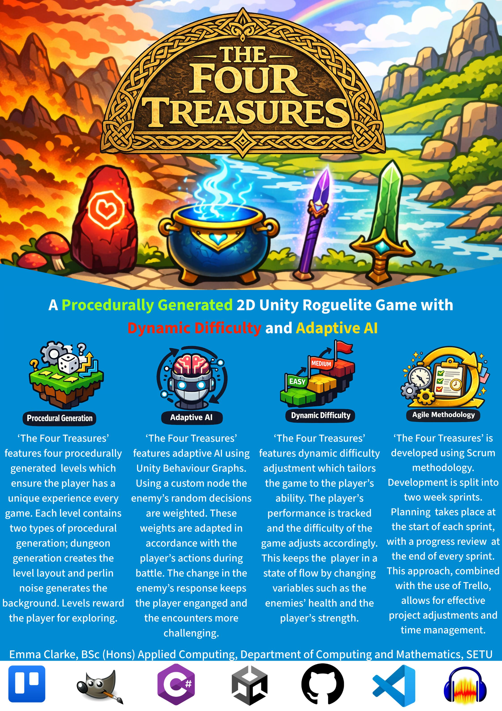

## The Four Treasures - Emma Clarke

### Abstract

**The Four Treasures** is a 2D Unity Roguelite game set in a mythical rendition of Celtic Ireland. Its characters are inspired by Irish mythology, with their stories reimagined to give players a new experience. 
Playing as the protagonist Tarann, you must traverse through four procedurally generated levels, encountering various enemies and bosses in a quest to find the four Treasures of the Tuatha, which have been stolen from you. These encounters are kept engaging through the use of dynamic difficulty adjustments and adaptive AI implemented using Unity's behaviour graphs.

| | |
|-------|-------|
| **Project Number** | 5 |
| **Student Name** | Emma Clarke |
| **Student ID** | W20102506 |
| **Supervisor** | Brendan Lyng |
| **Project Title** | The Four Treasures |
| **Landing Page** | https://emmac1804.github.io/The-Four-Treasures-LandingPage/ |
| **Programme** | BSc (Honours) in Applied Computing |

