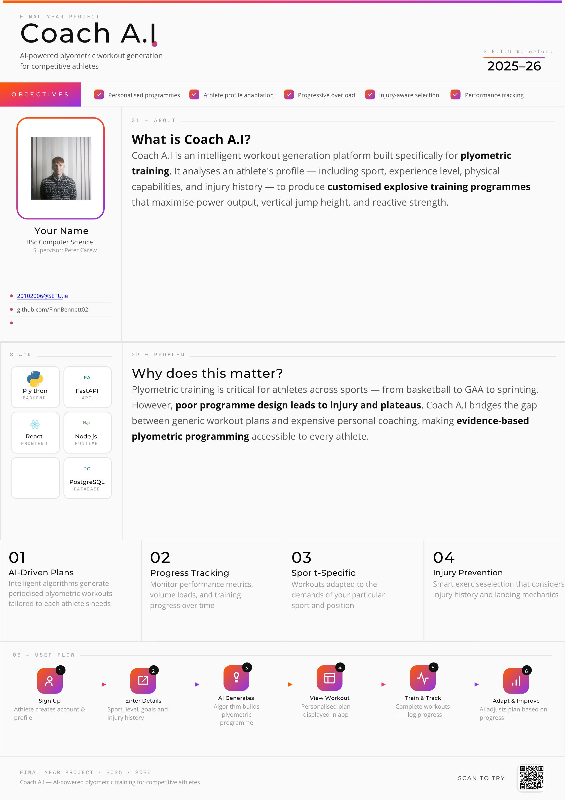

## Coach A.I - Finn Bennett

### Abstract

Coach A.I plans to be an AI powered chat bot, thats sole purpose is to provide strong plyometric workouts for its users. Coach A.I's backend will run on python and will use open A.I to power it. User data will be safely secured in a Postgres database to allow for more personalisation and uniqueness. Users will be able to login, create a plan, generate workouts, add in past injury history and get personalised workouts based on their specific needs. Coach A.I is not just for athletes as plyometrics can benefit anyone anywhere in whatever aspects of life the user sees fit.

| | |
|-------|-------|
| **Project Number** | 2 |
| **Student Name** | Finn Bennett |
| **Student ID** | W20102006 |
| **Supervisor** | Dr Peter Carew |
| **Project Title** | Coach A.I |
| **Landing Page** | https://github.com/FinnBennett02/FinalYearProject.git |
| **Programme** | BSc (Honours) in Applied Computing |

