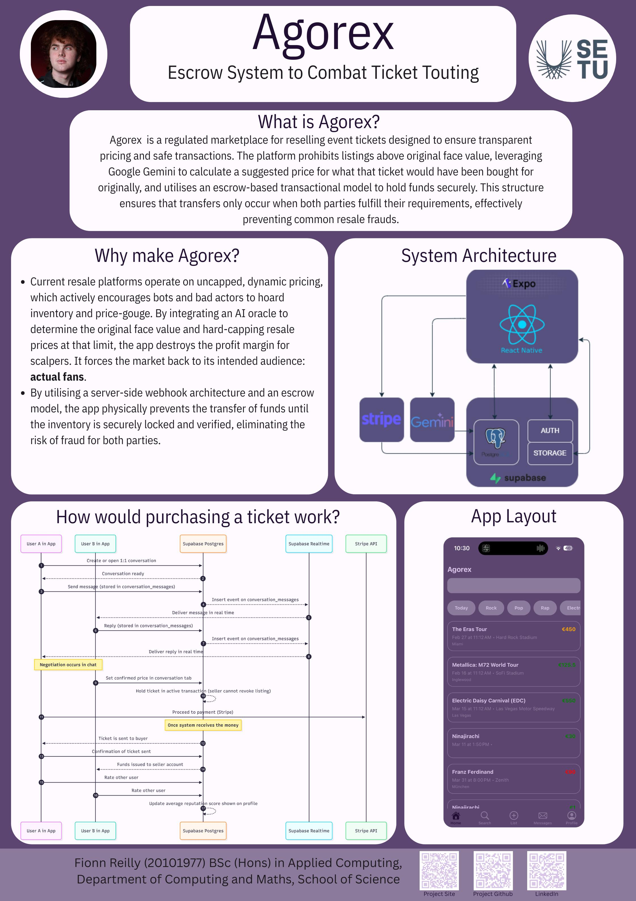

## Agorex - Fionn Reilly

### Abstract

Agorex is a secure mobile marketplace for reselling event tickets that eliminates scalping and fraud. Built with React Native and Supabase, the app uses Google Gemini AI to analyse event data and enforce a face-value price cap on every listing, ensuring buyers never overpay. To guarantee safe exchanges, utilising a Stripe webhook architecture that locks ticket inventory during checkout, effectively acting as an escrow system. Funds and tickets transfer only when payment clears, creating a transparent, peer-to-peer ticketing ecosystem built entirely around fairness and trust.

| | |
|-------|-------|
| **Project Number** | 29 |
| **Student Name** | Fionn Reilly |
| **Student ID** | W20101977 |
| **Supervisor** | Rob O'Connor |
| **Project Title** | Agorex |
| **Landing Page** | https://reifionn.github.io/FYP-Pages/ |
| **Programme** | BSc (Honours) in Applied Computing |

