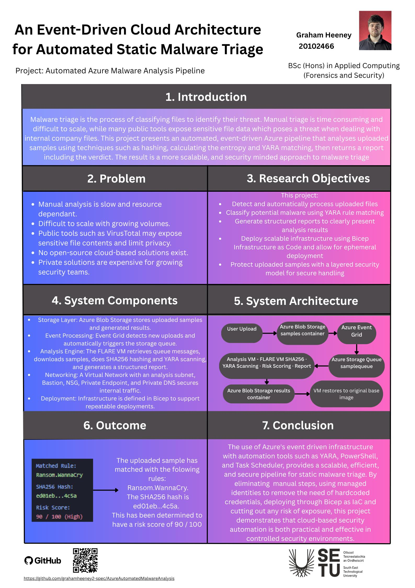

## Automated Malware Analysis Pipeline - Graham Heeney

### Abstract

This project displays the implementation of a automated malware analysis pipeline using Azure Cloud. This aims to imporve the safety, privacy and speed of malware triage with an event based automated pipeline. Its practical use is for keeping file triage safe and quick as public systems like VirusTotal sotre the file and allow it for download while company's do not want employees wasting too much time manually triaging these files. This is where my project may come of benefit, providing a base for automated malware triage.

| | |
|-------|-------|
| **Project Number** | 14 |
| **Student Name** | Graham Heeney |
| **Student ID** | W20102466 |
| **Supervisor** | Malik Faizan |
| **Project Title** | Automated Malware Analysis Pipeline |
| **Landing Page** | https://github.com/grahamheeney2-spec/AzureAutomatedMalwareAnalysis |
| **Programme** | BSc (Honours) in Applied Computing |

