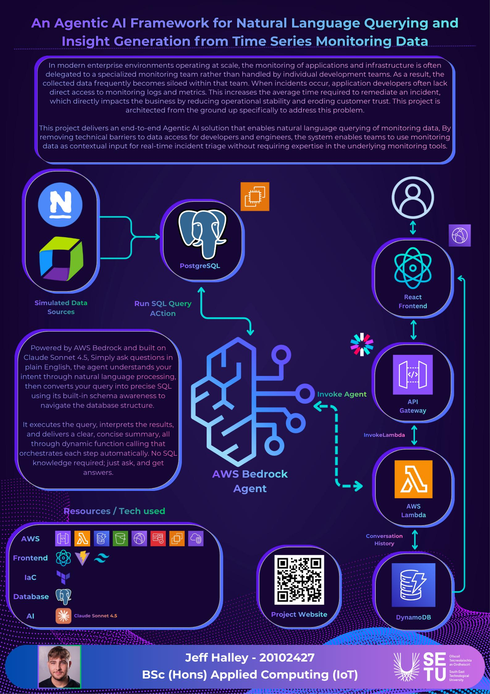

## QueryOps AI - Jeff Halley

### Abstract

QueryOps AI is a tool that lets any engineer query their monitoring data using plain English during live incidents. When an alert fires, the on-call engineer rarely has the full context they need to diagnose what's happening. Related checks or historical patterns all sit behind monitoring tools they can't access themselves. Every minute without that context is costly, research puts the hourly cost of downtime as high as \$5 million for 41% of large enterprises. QueryOps AI removes that bottleneck by letting engineers ask questions in plain English and get clear answers immediately.

| | |
|-------|-------|
| **Project Number** | 13 |
| **Student Name** | Jeff Halley |
| **Student ID** | W20102427 |
| **Supervisor** | Dr Frank Walsh |
| **Project Title** | QueryOps AI |
| **Landing Page** | https://d3212o90xjuosc.cloudfront.net/ |
| **Programme** | BSc (Honours) in Applied Computing |

