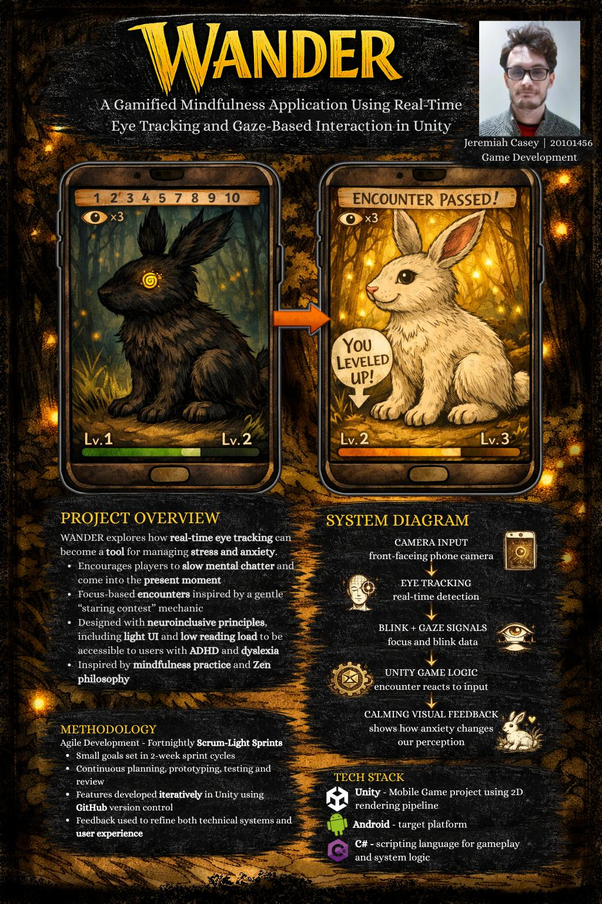

# WANDER - Jeremiah Casey

### Abstract

WANDER is a mobile mindfulness experience that uses real-time eye tracking and blink detection as interactive tools for stress and anxiety management. Built in Unity for Android with C#, it places the player in a calm, hand-drawn forest where focus-based encounters encourage steady attention and present-moment awareness. Through gentle visual feedback and neuroinclusive design, WANDER aims to reduce cognitive load and explore how playful digital experiences can support emotional regulation and mindfulness.

| | |
|-------|-------|
| **Project Number** | 4 |
| **Student Name** | Jeremiah Casey |
| **Student ID** | W20101456 |
| **Supervisor** | Brendan Lyng |
| **Project Title** | WANDER |
| **Landing Page** | https://20101456.github.io/wander-landing-page/ |
| **Programme** | BSc (Honours) in Applied Computing |

