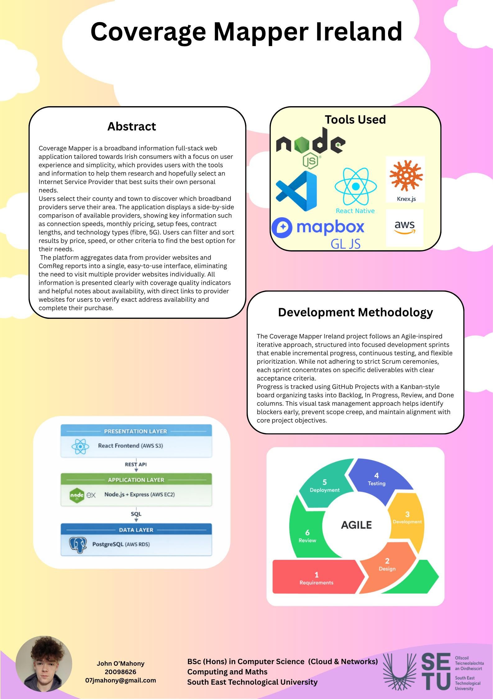

# Coverage Mapper Ireland - John O'Mahony

### Abstract

Coverage Mapper Ireland is a broadband information full-stack web application tailored towards Irish consumers with a focus on user experience and simplicity, which provides users with the tools and information to help them research and hopefully select an Internet Service Provider that best suits their own personal needs. The application displays a side-by-side comparison of available providers, showing key information such as connection speeds, monthly pricing, setup fees, contract lengths, and technology types (fibre, 5G).

| | |
|-------|-------|
| **Project Number** | 27 |
| **Student Name** | John O'Mahony |
| **Student ID** | W20098626 |
| **Supervisor** | Komal Komal |
| **Project Title** | Coverage Mapper Ireland |
| **Landing Page** | https://20098626j.github.io/Coverage-Mapper-Ireland/ |
| **Programme** | BSc (Honours) in Applied Computing |

