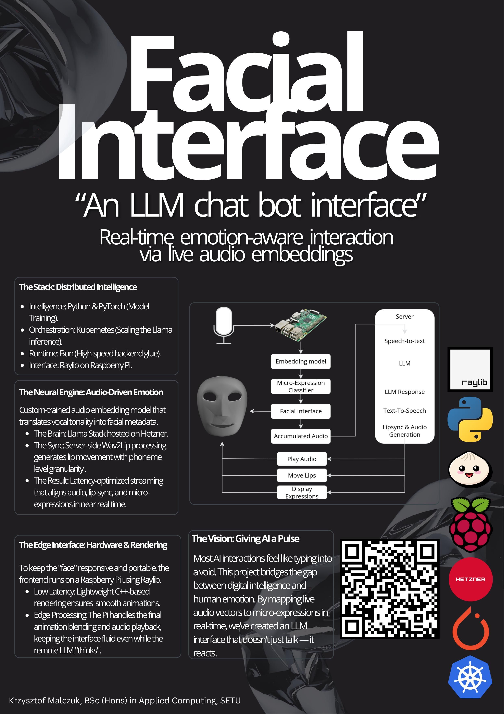

## Facial Interface for AI Agents - Krzysztof Malczuk

### Abstract

This project is a facial interface for AI agents that displays real-time emotional expressions during conversation. It processes live audio input and uses vector embeddings to detect sentiment and tone, which are mapped to dynamic facial animations rendered in C++ using Raylib on a Raspberry Pi. AI responses are generated using Llama Stack, converted to speech, and streamed back for playback, enabling a fully voice-based interaction with no text display. The system is deployed with a Kubernetes backend using a Bun-based service for faster processing.

| | |
|-------|-------|
| **Project Number** | 21 |
| **Student Name** | Krzysztof Malczuk |
| **Student ID** | W20102482 |
| **Supervisor** | Dr Kieran Murphy |
| **Project Title** | Facial Interface for AI Agents |
| **Landing Page** | https://2000krysztof.github.io/final-year-project/ |
| **Programme** | BSc (Honours) in Applied Computing |

