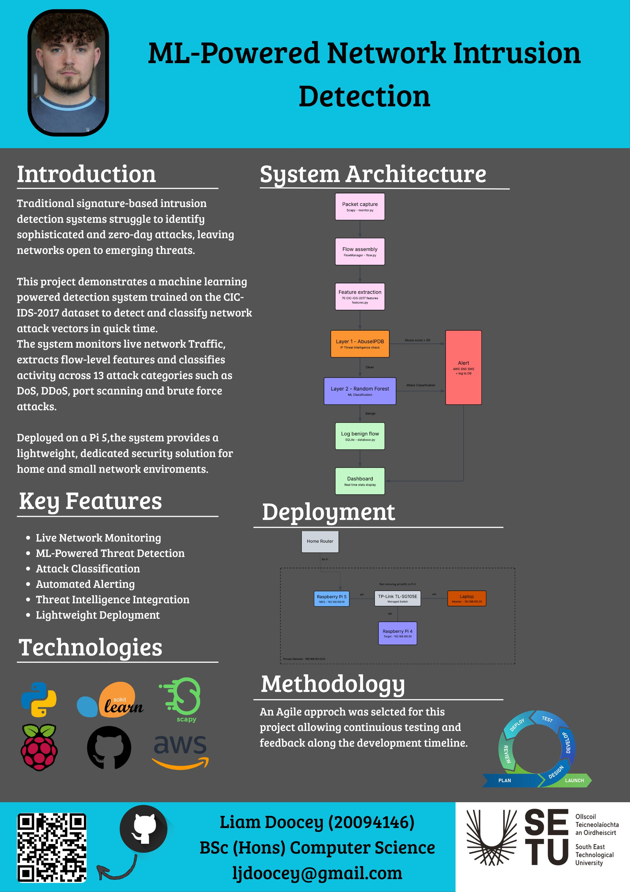

## PiSentry - Liam Doocey

### Abstract

Traditional network intrusion detection systems rely on known attack signatures, leaving networks exposed to new threats. This project leverages machine learning to detect and classify network attacks as they occur. Trained on ~2.5 Million flows from the CIC-IDS-2017 Dataset, a ML classifier identifies 13 different attack types such as DoS, DDoS and brute force. Deploying the system out-of-band on a raspberry pi 5, cuts the single network bottleneck while also sending alerts when processed traffic is flagged as malicious.

| | |
|-------|-------|
| **Project Number** | 10 |
| **Student Name** | Liam Doocey |
| **Student ID** | W20094146 |
| **Supervisor** | Kurt Pumares |
| **Project Title** | PiSentry |
| **Landing Page** | https://liamdoocey.github.io/ml-nids/ |
| **Programme** | BSc (Honours) in Applied Computing |

