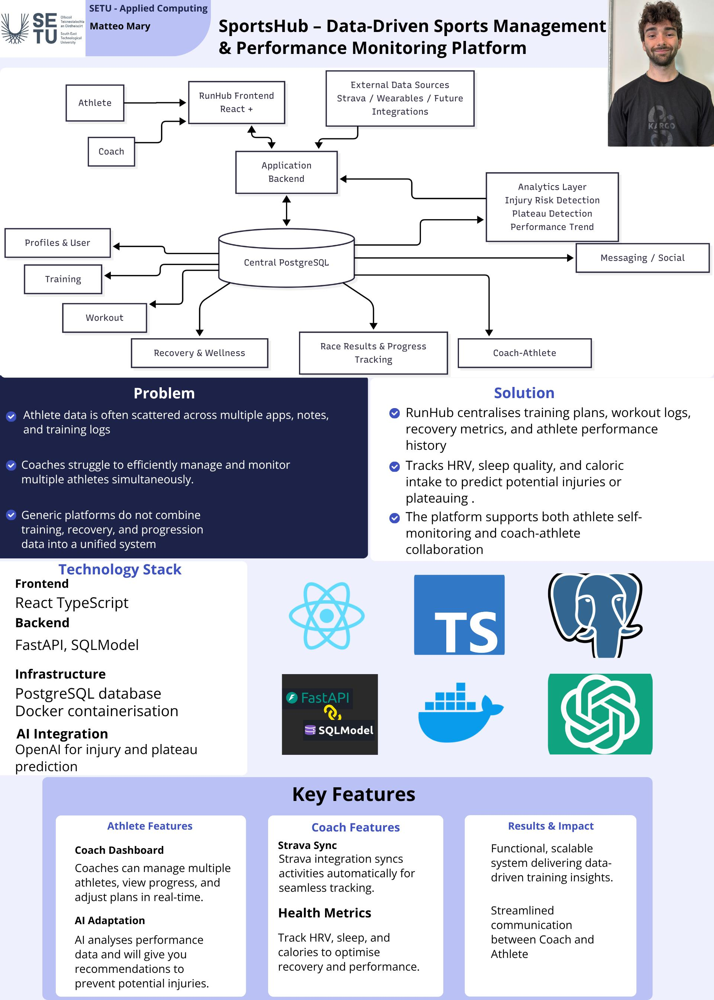

## RunHub - Matteo Mary

### Abstract

RunHub is a full-stack web app for runners and coaches that brings everything into one place. Training plans, workouts, recovery data, and performance tracking. Instead of using multiple apps, everything is connected in a single system so you can easily monitor progress and manage training. It also includes some smart features using AI that analyse your data such as HRV, training intensity, sleep score and caloric intake to flag things like injury risk or performance plateaus, helping athletes and coaches make better decisions.

| | |
|-------|-------|
| **Project Number** | 22 |
| **Student Name** | Matteo Mary |
| **Student ID** | W20098764 |
| **Supervisor** | Richard Lacey |
| **Project Title** | RunHub |
| **Landing Page** | https://matteomary.github.io/ |
| **Programme** | BSc (Honours) in Applied Computing |

