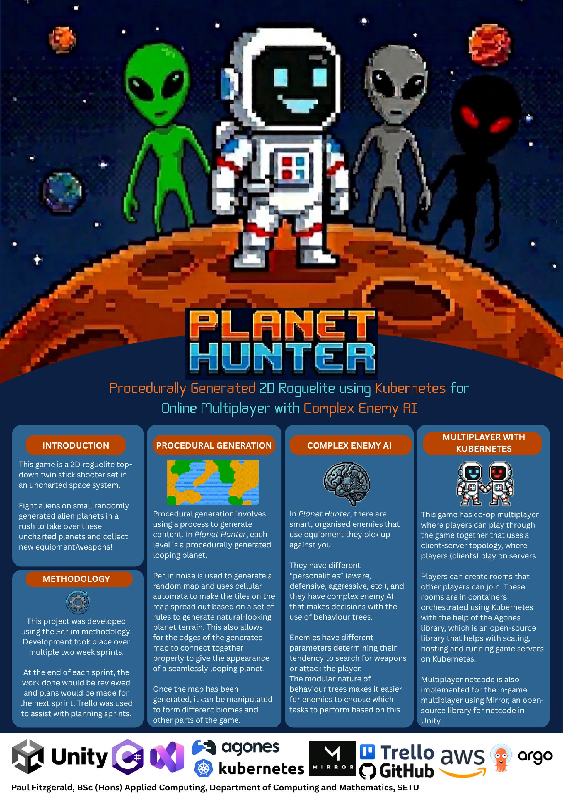

# Planet Hunter - Paul Fitzgerald

### Abstract

Planet Hunter is a 2D roguelite top-down twin stick shooter set in an uncharted space system. The player can fight aliens on small randomly generated planets to take over these uncharted planets and collect new equipment/weapons. Planet Hunter procedurally generates looping planet levels using Perlin noise and cellular automata. It also uses behaviour trees for smart enemy AI that have different "personalities" (e.g. aggressive, defensive). There is also co-op online multiplayer that orchestrates game rooms using Kubernetes with the help of Agones.

| | |
|-------|-------|
| **Project Number** | 12 |
| **Student Name** | Paul Fitzgerald |
| **Student ID** | W20102629 |
| **Supervisor** | Brendan Lyng |
| **Project Title** | Planet Hunter |
| **Landing Page** | https://paul123111.github.io/ |
| **Programme** | BSc (Honours) in Applied Computing |

