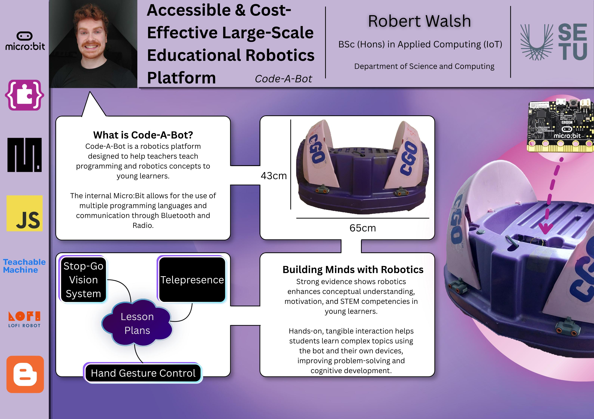

## Code-A-Bot - Robert Walsh

### Abstract

This project is a robotics platform designed to help teachers introduce programming and robotics to young students in a simple and engaging way. It includes ready to use tools and lesson plans that explore topics like machine learning, vision systems, and telepresence through hands-on activities. Using the Micro:Bit, beginners can start with visual coding in MakeCode, while more advanced learners can use MicroPython or JavaScript. The aim is to make STEM learning accessible, interactive and enjoyable from an early age.

| | |
|-------|-------|
| **Project Number** | 32 |
| **Student Name** | Robert Walsh |
| **Student ID** | W20102479 |
| **Supervisor** | Jason Berry |
| **Project Title** | Code-A-Bot |
| **Landing Page** | https://robert-walshh.github.io/code-a-bot/ |
| **Programme** | BSc (Honours) in Applied Computing |

