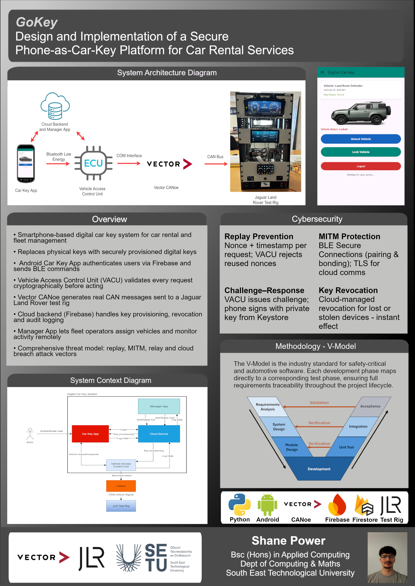

## GoKey - Shane Power

### Abstract

This project aims to design and implement a secure smartphone-based digital car key system, with a focus on car rental and car fleet management. The aim of the system is to replace traditional physical keys with securely provisioned digital keys. This will improve user convenience and reduce the administrative overhead and the security risks associated with handling physical keys. This is inspired by the shift in the car industry towards keyless vehicle access, and the growth of contactless, app-based car rental services.

| | |
|-------|-------|
| **Project Number** | 28 |
| **Student Name** | Shane Power |
| **Student ID** | W20102592 |
| **Supervisor** | Brendan Jackman |
| **Project Title** | GoKey |
| **Landing Page** | https://shanepower22.github.io/car-key-app/ |
| **Programme** | BSc (Honours) in Applied Computing |

