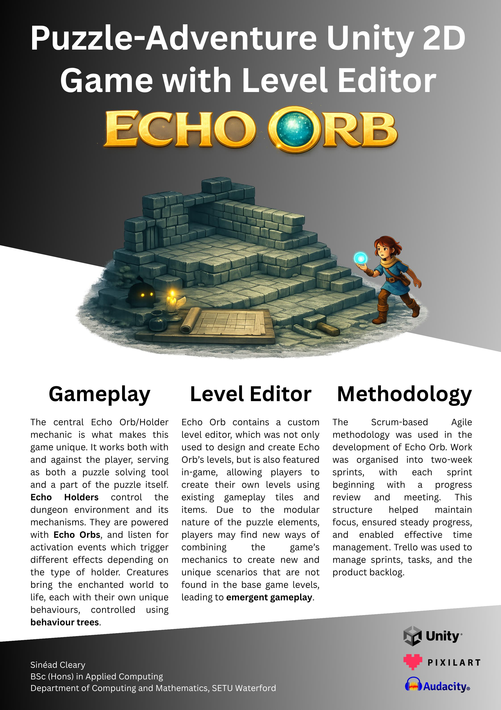

## Echo Orb - Sinéad Cleary

### Abstract

Echo Orb is a puzzle-adventure game with a custom level editor, which was not only used to design and create Echo Orb's levels, but is also featured in-game, allowing players to create their own levels using existing gameplay elements. The central Echo Orb/Holder mechanic controls the game's dungeon environment and its mechanisms. It works both with and against the player, serving as both a puzzle solving tool and a part of the puzzle itself. Creatures roam the dungeon, controlled using behaviour trees. Custom levels and combinations of puzzle mechanics lead to emergent gameplay.

| | |
|-------|-------|
| **Project Number** | 6 |
| **Student Name** | Sinéad Cleary |
| **Student ID** | W20102299 |
| **Supervisor** | Brendan Lyng |
| **Project Title** | Echo Orb |
| **Landing Page** | https://sineadcleary.github.io/FYPLandingPage/ |
| **Programme** | BSc (Honours) in Applied Computing |

