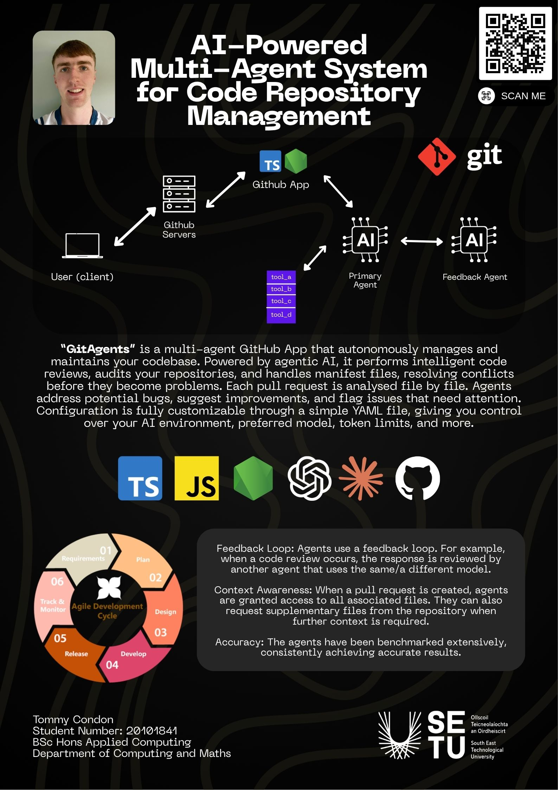

## Git Agents - Tommy Condon

### Abstract

GitAgents is a GitHub App that uses AI agents to review your pull requests. When a PR is opened, the app can execute a Code Review Agent and (optionally) a Dependency Review Agent, passing the results through a Feedback Agent before posting the final review on GitHub. This tool serves as an initial screening layer, reducing Pull Request review time.

It supports both OpenAI and Anthropic (Claude) models. You can configure which model to use and how the agents behave through a YAML config file in your repository.

The project is completely Open-Source and available on GitHub.

| | |
|-------|-------|
| **Project Number** | 7 |
| **Student Name** | Tommy Condon |
| **Student ID** | W20101841 |
| **Supervisor** | Malik Faizan |
| **Project Title** | Git Agents |
| **Landing Page** | https://gitagents.super.site/ |
| **Programme** | BSc (Honours) in Applied Computing |

