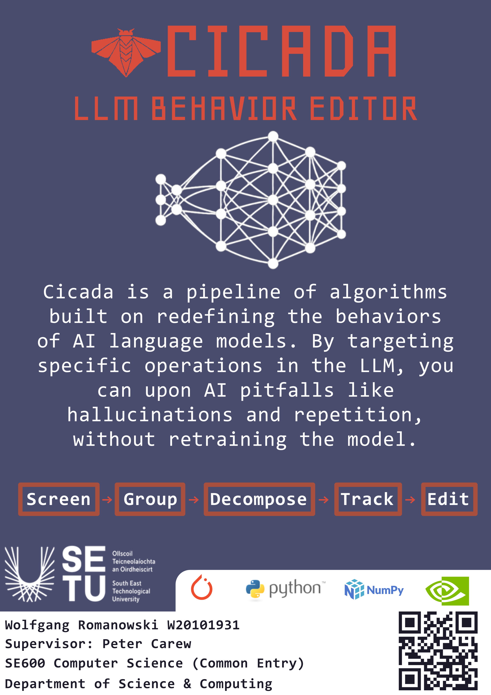

## Cicada - Wolfgang Romanowski

### Abstract

CICADA is a framework for controlling the behaviour of large language models without retraining or fine-tuning. It analyses a model’s internal structure to identify components responsible for specific behaviours and enables precise, surgical modification. Multiple interventions can be applied simultaneously without degrading existing capabilities. CICADA also supports injecting new capabilities while preserving original function, and has been validated across model scales with consistent results and no loss in baseline performance.

| | |
|-------|-------|
| **Project Number** | 30 |
| **Student Name** | Wolfgang Romanowski |
| **Student ID** | W20101931 |
| **Supervisor** | Dr Peter Carew |
| **Project Title** | Cicada |
| **Landing Page** | https://cicada-flame.vercel.app/ |
| **Programme** | BSc (Honours) in Applied Computing |

