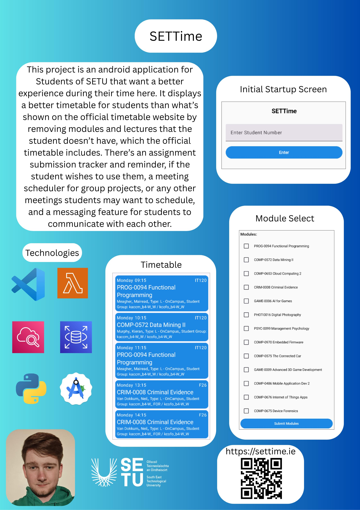

## SETTime - Daniel O'Brien

### Abstract

This project is an android application for Students of SETU that want a better experience during their time here. It displays a better timetable for students than what’s shown on the official timetable website by removing modules and lectures that the student doesn’t have, which the official timetable includes. There’s an assignment submission tracker and reminder, if the student wishes to use them, a meeting scheduler for group projects, or any other meetings students may want to schedule, and a messaging feature for students to communicate with each other.

| | |
|-------|-------|
| **Project Number** | 26 |
| **Student Name** | Daniel O'Brien |
| **Student ID** | W20101948 |
| **Supervisor** | Dr Anita Kealy |
| **Project Title** | SETTime |
| **Landing Page** | https://www.settime.ie |
| **Programme** | BSc (Honours) in Applied Computing |

