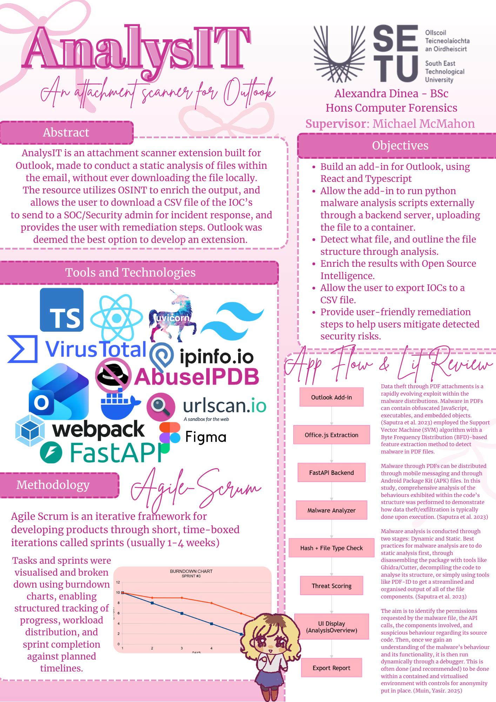

# AnalysIT Attachment Scanner - Alexandra Dinea

### Abstract

AnalysIT is an attachment scanner extension built for Outlook, made to conduct a static analysis of files within the email, without ever downloading the file locally. The resource utilizes OSINT to enrich the output, and allows the user to download a CSV file of the IOCs to send to a SOC/Security admin for incident response, and provides the user with remediation steps. Outlook was deemed the best option to develop an extension for its widespread enterprise adoption and seamless integration capabilities within organizational security workflows.

| | |
|-------|-------|
| **Project Number** | 35 |
| **Student Name** | Alexandra Dinea |
| **Student ID** | W20101924 |
| **Supervisor** | Michael McMahon |
| **Project Title** | AnalysIT Attachment Scanner |
| **Landing Page** | https://github.com/alexalexiiii/final-year-project |
| **Programme** | BSc in Computer Forensics and Security |

