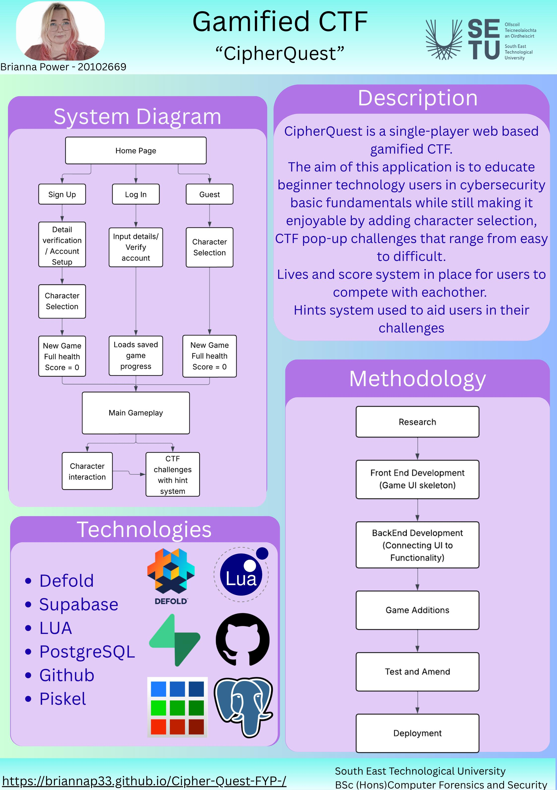

# CipherQuest - Brianna Power

### Abstract

CipherQuest is a single-player web-based gamified CTF.
The aim of this application is to educate beginner technology users in fundamental cybersecurity concepts while still making it enjoyable by adding character selection, CTF pop-up challenges that range from easy to difficult and non-playable character interactions placing the user in different scenarios to help the player understand real-world situations.
Lives and score system is in place for players to compete with each other. Hints system is used to aid players in their challenges.

| | |
|-------|-------|
| **Project Number** | 40 |
| **Student Name** | Brianna Power |
| **Student ID** | W20102669 |
| **Supervisor** | Komal Komal |
| **Project Title** | CipherQuest |
| **Landing Page** | https://briannap33.github.io/Cipher-Quest-FYP-/ |
| **Programme** | BSc in Computer Forensics and Security |

