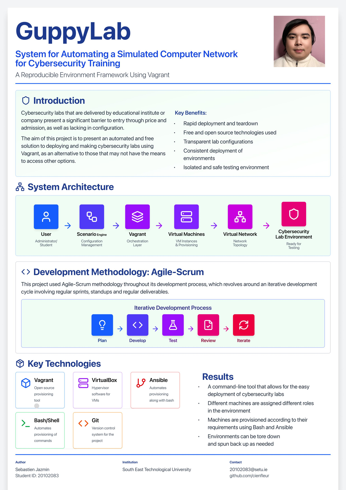

## GuppyLab - Sebastien Jazmin

### Abstract

This project is a small command line tool that aims to leverage multiple technologies, mainly Vagrant, in order to deploy local cybersecurity labs. This is done by preconfigured Vagrantfiles that describe scenarios, where there are multiple machines with various roles, such as attacker, victim, etc. These machines are configured with their own OS, network settings, etc., and post deployment provisioning is handled through the use of Bash and Ansible scripts.  The goal of this project is to deliver environments that can be readily deployed and tore down using free software.

| | |
|-------|-------|
| **Project Number** | 37 |
| **Student Name** | Sebastien Jazmin |
| **Student ID** | W20102083 |
| **Supervisor** | Komal Komal |
| **Project Title** | GuppyLab |
| **Landing Page** | https://github.com/cienfleur/fyp-project-2026 |
| **Programme** | BSc in Computer Forensics and Security |

