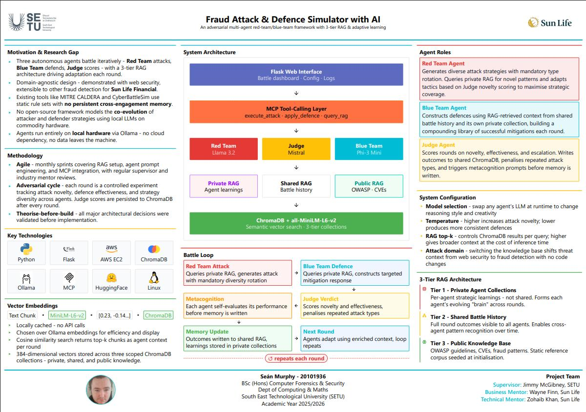

## Fraud Attack & Defence Simulator with AI - Seán Murphy

### Abstract

This project presents a domain-agnostic adversarial AI framework where three autonomous agents - Red Team (attack), Blue Team (defence), and Judge (evaluation) - compete in iterative battle rounds. Each agent draws on a three-tier knowledge architecture: private strategic memory, shared battle history, and a public knowledge base, implemented via ChromaDB and local LLMs through Ollama on AWS EC2. A metacognition loop enables agents to self-assess and retain strategic insights between rounds. Demonstrated through web security scenarios.

| | |
|-------|-------|
| **Project Number** | 38 |
| **Student Name** | Seán Murphy |
| **Student ID** | W20101936 |
| **Supervisor** | Jimmy McGibney |
| **Project Title** | Fraud Attack & Defence Simulator with AI |
| **Landing Page** | https://seanmurphy1479.github.io/fyp_site/ |
| **Programme** | BSc in Computer Forensics and Security |

